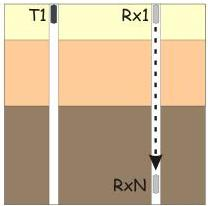
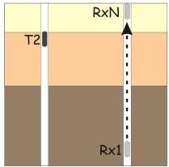
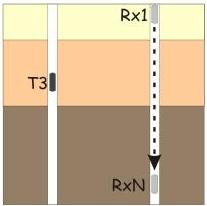
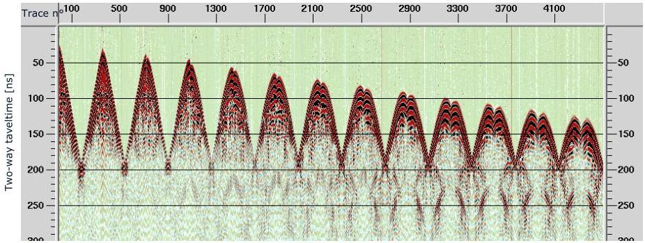

[LOGO]

UNIVERSITÀ
DEGLI STUDI
DI TRIESTE

UD4d

# A Borehole GPR Tomography example

Example of borehole
GPR tomography

acquisition scheme:
Tx increment = 50cm
Rx increment = 10cm

Pipan et al., 2005

MEMAG A.A. 2021-2022

28