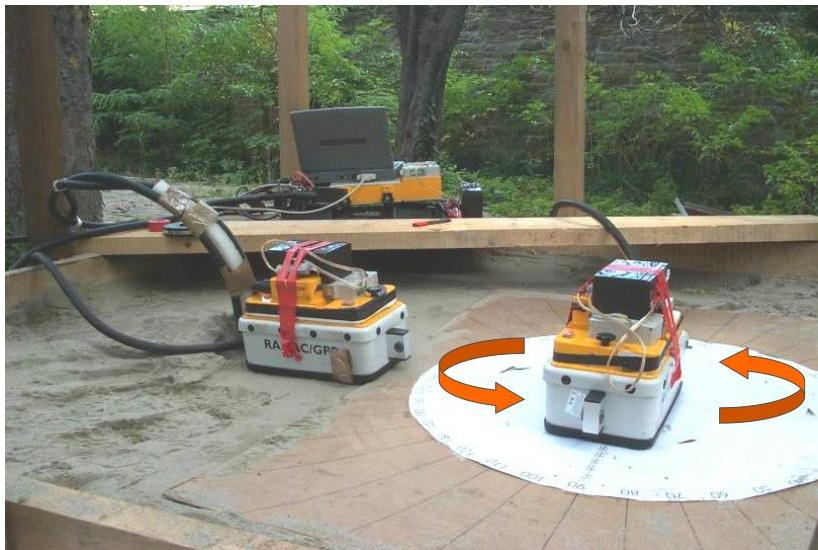

UNIVERSITÀ
DEGLI STUDI
DI TRIESTE

UD4d

# Ground Penetrating Radar: multi azimuth acquisition

By using 2 separated antennas it is possible to change: Offset and/or Azimuth → AVO
AVA analyses and polarimetric measurements.

MEMAG A.A. 2021-2022 3