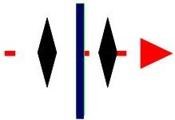
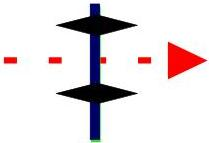
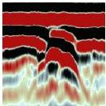
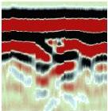
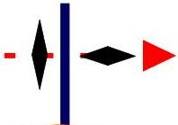
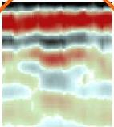

UNIVERSITAS DEGLI STUDIORITIS

UNIVERSITÀ
DEGLI STUDI
DI TRIESTE

UD4d

# Ground Penetrating Radar: multi azimuth acquisition

CO-POLARIZATION

TE (Broadside) TM (Broadside)

Linear Target

Linear Target

|  E a) H | CO-POLARIZED |   | CROSS-POLARIZED  |
| --- | --- | --- | --- |
|   |  END FIRE | BROADSIDE  |   |
|  TM | b) | c) | d)  |
|  TE | e) | f) | g)  |

CROSS-POLARIZATION

Linear Target

AMPLITUDE << and not negligible only for linear targets due to their DEPOLARIZING EFFECT

MEMAG A.A. 2021-2022

4