UNIVERSITAS DEGLI STUDIOR
MURATIS

UNIVERSITÀ
DEGLI STUDI
DI TRIESTE

UD4d

# Ground Penetrating Radar: co- and cross- polarization

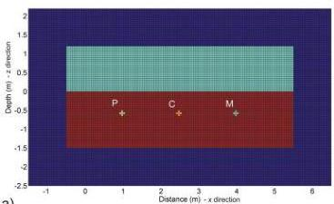

a)

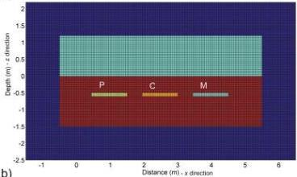

b)

A: plastic (P), concrete (C) and metallic (M) pipes positioned perpendicular to the GPR survey direction.
B: plastic (P), concrete (C) and metallic (M) positioned parallel to the GPR survey direction.

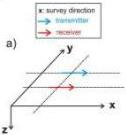

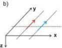

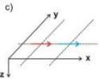

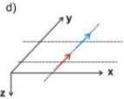

Config. A

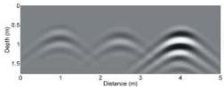

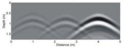

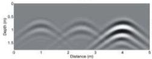

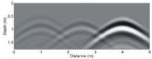

Config. B

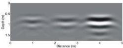

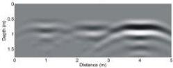

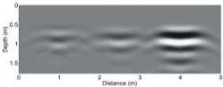

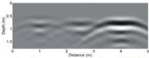

Santos and Teixeira, 2017

100 MHz GPR results obtained for Configurations A and B, using different co-polarized antenna orientations (a–d).

It is possible to exploit de-polarization effects to quickly determine the DIRECTION of linear targets (pipes, walls,...)

Also the characteristics of materials can be estimated

MEMAG A.A. 2021-2022

5