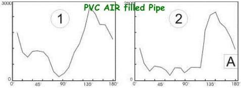
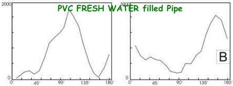
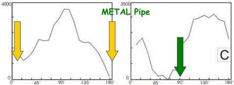
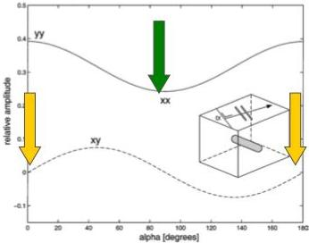

UNIVERSITAS DEGLI STUDIORUM
MIMES

UNIVERSITÀ
DEGLI STUDI
DI TRIESTE

UD4d

# Ground Penetrating Radar: Multi-components

## CROSS-POLE CO-POLE

Pipan et al., 2003

Real DATA

Pipe direction=0°

Theoretical values

FIG. 3. Theoretical reflection response of a cylinder versus angle α between the orientation of the antennas and cylinder. Inset shows simplified representation of the setup. The copolarized and crosspolarized configurations are shown with a solid and a dashed line, respectively. For these calculations the perfectly conducting cylinder has a length of 1 m and a diameter of 20 cm and is embedded in sand with εt = 5, σ = 0 mS/m, and μr = 1.

Da Van Gestel e Stoffa, 2002

MEMAG A.A. 2021-2022

6