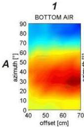
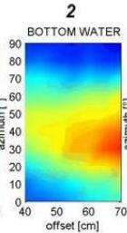
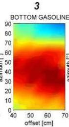
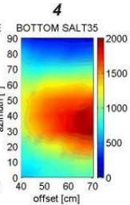
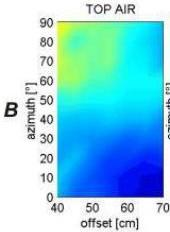
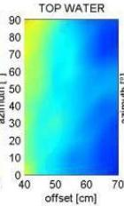
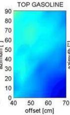
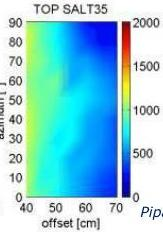

[LOGO]

UNIVERSITÀ
DEGLI STUDI
DI TRIESTE

UD4d

# Ground Penetrating Radar: Multi-components AVO and AVA

GPR AVO (Amplitude versus Offset) and AVA (Amplitude versus Azimuth) analysis performed on a PVC pipe filled with different fluids. Columns 1 to 4: (1) air, (2) fresh water, (3) gasoline, and (4) salt water (salinity about 35 ‰). Rows A and B: (A) amplitude of reflection from metal base and (B) amplitude of reflection from top of the pipe.

MEMAG A.A. 2021-2022

7