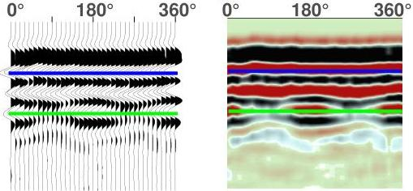
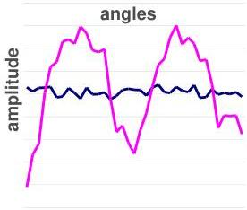
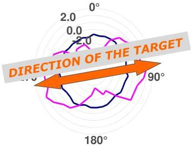

UNIVERSITAS
DEGLI STUDI
DI TRIESTE

UNIVERSITÀ
DEGLI STUDI
DI TRIESTE

UD4d

# Ground Penetrating Radar: Multi-components AVO and AVA

When there are
AVA variations →
there are linear
TARGETS

- Constant amplitude
- Sinusoidal amplitude variations

Polar diagram of
amplitude variations

With this approach it is possible to derive the
linear target orientation even in zones with
logistical constraints (obstacles, limited
operative dimensions, surface variations, ...)

MEMAG A.A. 2021-2022

8