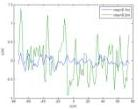
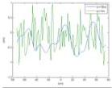

The 9th International Conference on Environmental and Engineering Geophysics

IOP Publishing

IOP Conf. Series: Earth and Environmental Science 660 (2021) 012047 doi:10.1088/1755-1315/660/1/012047

(a)

(b)

Figure1. (a). Rough surface corresponding to different RMS height with the same correlation length (lc = 2m); (b). Rough surface corresponding to different correlation length with the same RMS height(rms = 0.5m).

### 2.3. Inversion method based on geometric ray theory

The velocity analysis method we used was proposed by Forte et al. in 2014. We assume that the propagation signal is a plane EM wave. Near each trace location, the underground medium is assumed to be homogeneous, isotropic, non-magnetic ( \( \mu_{r}=1 \) ), non-conductive ( \( \sigma=0 \) ), and non-dispersible. The changes of antenna coupling, inherent attenuation and scattering effect are ignored. Normal GPR surveys are performed in transverse electric (TE) broadside configuration. Therefore, we only consider the TE mode (Forte et al., 2014). According to these assumptions, the proposed method requires offset(x), velocity of the first layer medium ( \( v_{1} \) ), amplitude of direct wave ( \( Ai_{1} \) ), amplitude of reflected wave ( \( As_{i} \) ) and travel time ( \( TWT_{i} \) ).

Given the first layer velocity \((v_{1})\), offset(x), and travel time of the first layer \((TWT_{1})\), we can get the thickness of the first layer \((h_{1})\) by equation (1):

\[
h _ {1} = \frac {1}{2} \sqrt {\left(v _ {1} T W T _ {1}\right) ^ {2} - x ^ {2}} \tag {1}
\]

Then the angle of incidence is obtained by equation(2):

\[
\theta_ {1} = \operatorname{Arctan} \left(\frac {x}{2 h _ {1}}\right) \tag {2}
\]

Using the amplitude values picked up ( \( As_{1} \)  and  \( Ai_{1} \) ), the reflection coefficient of the first layer  \( R_{1} \)  can be obtained by equation (3).

\[
R _ {1} = \frac {A s _ {1}}{A i _ {1}} \tag {3}
\]

Then Snell equation gives the velocity of GPR signal in the second layer:

\[
v _ {2} = \frac {\sin (\theta_ {2})}{\sin (\theta_ {1})} v _ {1} \tag {4}
\]

Where \(\theta_{2}\) is obtained by rearranging the Fresnel equation of TE mode [1]:

\[
\theta_ {2} = \operatorname{Arctan} \left(\frac {1 + R _ {1}}{1 - R _ {1}} \tan \theta_ {1}\right) \tag {5}
\]

If we know the thickness of the first n - 1 layers, the GPR signal velocities of the first n layers and the  \( TWT_{n} \)  of the nth interface reflected wave, then the thickness of the nth layer ( \( h_{n} \) ) is the only positive solution of the following third-degree equation [1]:

\[
a h _ {n} ^ {3} + b h _ {n} ^ {2} + c h _ {n} + d = 0 \tag {6}
\]

where

\[
a = \frac {4}{v _ {n}} \tag {7}
\]

\[
\mathrm{b} = \frac {4}{v _ {n} ^ {2}} \sum_ {i = 1} ^ {n - 1} v _ {i} h _ {i} + 8 \sum_ {i = 1} ^ {n - 1} \frac {h _ {i}}{v _ {i}} \tag {8}
\]

2