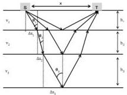

The 9th International Conference on Environmental and Engineering Geophysics

IOP Publishing

IOP Conf. Series: Earth and Environmental Science 660 (2021) 012047 doi:10.1088/1755-1315/660/1/012047

$$c = \frac{x^2}{v_n} + \frac{8}{v_n} \left( \sum_{i=1}^{n-1} v_i h_i \right) \left( \sum_{i=1}^{n-1} \frac{h_i}{v_i} \right) + 4 v_n (\sum_{i=1}^{n-1} \frac{h_i}{v_i})^2 - v_n T W T_n^2 \tag{9}$$

In horizontally layered media, the incident angle of the $k$th interface is equal to the transmitted angle of the $(k - 1)$th interface. Such angle $(\theta_k)$ is related to the horizontal projection $(\Delta x_k)$ of the travel path in the kth layer (Fig.2) through the following equation:

$$\text{Tan}(\theta_k) = \frac{\Delta x_k}{h_k} \tag{10}$$

Considering the small value of $\theta_k$ and the Snell's equation, we obtain:

$$\Delta x_k = \frac{v_k h_k}{v_{k-1} h_{k-1}} \Delta x_{k-1} \tag{11}$$

According to geometric conditions:

$$\sum_{i=1}^{n} \Delta x_i = \frac{x}{2} \tag{12}$$

Then, we can use the Fresnel equation for TE antenna configuration to calculate the first $n - 1$ reflection and transmission coefficients relative to the nth reflected wave:

$$R_k = \frac{\sin(\theta_{k+1} - \theta_k)}{\sin(\theta_{k+1} + \theta_k)} \tag{13}$$

$$T_k = 1 + R_k \tag{14}$$

with $k = 1, 2, \cdots, n - 1$.

Figure 2. Schematic diagram of electromagnetic wave ray path in horizontally layered media (take three-layer medium as an example). S represents the transmitter, R represents the receiver, x is the offset, $h_i$ and $v_i$ are respectively the thicknesses and EM velocities of the layers, $\theta_i$ and $\Delta x_i$ are respectively the incident angles and the horizontal projections of the travel path.

Considering the symmetry of the travel path (Fig.2), and using the above coefficients and amplitudes we picked ($As_n$ and $Ai_1$), we can obtain the incident and reflected amplitudes of the nth interface by the follow equation:

$$\text{Ai}_n = \prod_{i=1}^{n-1} T_i \tag{15}$$

$$\text{Ar}_n = \frac{\text{As}_n}{\prod_{i=1}^{n-1} (2 - T_i)} \tag{16}$$

Then, the reflection coefficient of the $n$ th interface is given by:

$$R_n = \frac{\text{Ar}_n}{\text{Ai}_n} \tag{17}$$

The velocity in the $(n + 1)$th layer is given by the Snell's equation:

3