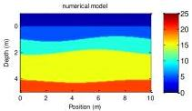
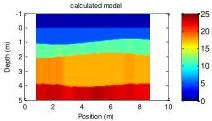

The 9th International Conference on Environmental and Engineering Geophysics

IOP Publishing

IOP Conf. Series: Earth and Environmental Science 660 (2021) 012047 doi:10.1088/1755-1315/660/1/012047

\[
v _ {n + 1} = \frac {\sin (\theta_ {n + 1})}{\sin (\theta_ {n})} v _ {n} \tag {18}
\]

with

\[
\theta_ {n + 1} = \operatorname{Arctan} \left(\frac {1 + R _ {n}}{1 - R _ {n}} \tan \theta_ {n}\right) \tag {19}
\]

By iterating this method for all the interpreted reflections in a GPR trace, we can obtain the thicknesses and velocities of all the imaged layers.

### 2.4. Numerical examples

First, we established three undulating stratum models of size  \( 10m \times 5m \) , with the same correlation length and different RMS heights. The specific parameters are shown in Table 1.

Table 1. Parameters of models used in forward modeling.

|   | Relative permittivity |   |   |   | L(m) | cl(m) | rms(m)  |
| --- | --- | --- | --- | --- | --- | --- | --- |
|   |  Layer 1 | Layer 2 | Layer 3 | Layer 4  |   |   |   |
|  Model 1 | 5 | 10 | 15 | 20 | 15 | 10 | 0.4  |
|  Model 2 | 5 | 10 | 15 | 20 | 15 | 10 | 0.3  |

Then, numerical simulation is performed on the established model with the following parameters:

Table 2. Parameters of forward simulation.

|  Frequency of transmitting antenna |   | 100MHz  |
| --- | --- | --- |
|  dt |   | 0.04ns  |
|  t |   | 120ns  |
|  Transmitting antenna | Start position | 0.5m  |
|   |  End position | 8.5m  |
|   |  Moving step | 0.25m  |
|  Receiving antenna | Start position | 1.0m  |
|   |  End position | 0.25m  |
|   |  Moving step | 9.0m  |

After obtaining the forward results, we pick up the reflection amplitude, perform the above iterative inversion on all traces of data, and perform linear interpolation on the space between the two tracks. The figures of numerical models and calculated results are as follows:

(a)

(b)

4