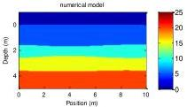
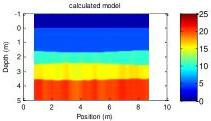
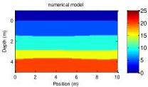
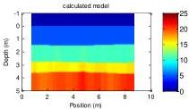
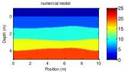
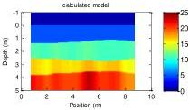

The 9th International Conference on Environmental and Engineering Geophysics

IOP Publishing

IOP Conf. Series: Earth and Environmental Science 660 (2021) 012047 doi:10.1088/1755-1315/660/1/012047

(c)

(d)

(e)

(f)

Figure 3. (a). Diagram of numerical model(rms = 0.4m); (b). Diagram of calculated model(rms = 0.4m); (c). Diagram of numerical model(rms = 0.3m); (d). Diagram of calculated model(rms = 0.3m); (e). Diagram of numerical model(rms = 0.2m); (f). Diagram of calculated model(rms = 0.2m);

The top blue layer of the diagram of models is air. The transmitting and receiving antennas are located at 0m on the y-axis.

Due to the position setting of transmitting antenna and the receiving antenna, we can only calculate the dielectric constant of the medium between 0.75m – 8.75m.

It can be seen from above examples that this method can be used for the inversion of co-offset GPR data. It can perfectly distinguish the shape and position of the reflection interface, but as the RMS increases, the calculation error of the permittivity of the medium is also increasing.

Then, we established three undulating stratum models with the same RMS heights and different correlation length. The specific parameters are shown in Table 3.

Table 3. Parameters of models used in forward modeling.

|   | Relative permittivity |   |   |   | L(m) | cl(m) | rms(m)  |
| --- | --- | --- | --- | --- | --- | --- | --- |
|   |  Layer 1 | Layer 2 | Layer 3 | Layer 4  |   |   |   |
|  Model 4 | 5 | 10 | 15 | 20 | 15 | 3 | 0.1  |
|  Model 5 | 5 | 10 | 15 | 20 | 15 | 4 | 0.1  |
|  Model 6 | 5 | 10 | 15 | 20 | 15 | 6 | 0.1  |

The figures of numerical models and calculated results are as follows:

(a)

(b)

5