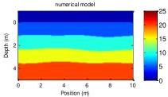
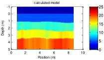
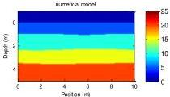
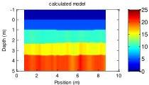

The 9th International Conference on Environmental and Engineering Geophysics

IOP Publishing

IOP Conf. Series: Earth and Environmental Science 660 (2021) 012047 doi:10.1088/1755-1315/660/1/012047

(c)

(d)

(e)

(f)

Figure 4. (a). Diagram of initial model ($\zeta$cl = 3m); (b). Diagram of calculated model ($\zeta$cl = 3m); (c). Diagram of initial model ($\zeta$cl = 4m); (d). Diagram of calculated model ($\zeta$cl = 4m); (e). Diagram of initial model ($\zeta$cl = 6m); (f). Diagram of calculated model ($\zeta$cl = 6m);

It can be seen from above examples, as the correlation length increases, the calculation error of the permittivity of the medium is also decreasing.

### 3. Conclusions

It is proved that the ray-tracing based inversion is feasible in the layered geological model with random undulation, as the RMS increases, that is, the degree of undulation of the reflection interface increases, the calculation error of the permittivity of the medium is also increasing; as the correlation length increases, that is, the degree of undulation of the reflection interface decreases, the calculation error of the permittivity of the medium is also decreasing.

### References

[1] Forte E, Dossi M, Pipan M and Colucci R R 2014 Velocity analysis from common offset GPR data inversion: theory and application to synthetic and real data Geophysical Journal International 197 1471-1483

[2] Yilmaz Ö 2001 Seismic data analysis: Processing, inversion, and interpretation of seismic data Society of exploration geophysicists

[3] Pipan M, Baradello L, Forte E, Prizzon A and Finetti I 1999 2-D and 3-D processing and interpretation of multi-fold ground penetrating radar data: a case history from an archaeological site Journal of Applied geophysics 41 271-292

[4] Taflove A and Hagness S C 2005 Computational electrodynamics: the finite-difference time-domain method Artech house

[5] Irving J and Knight R 2006 Numerical modeling of ground-penetrating radar in 2-D using MATLAB Computers & Geosciences 32 1247-1258

[6] Balanis C A 1999 Advanced engineering electromagnetics John Wiley & Sons

6