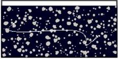
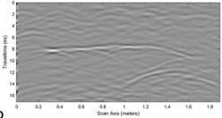
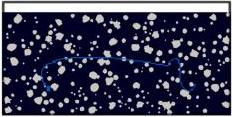
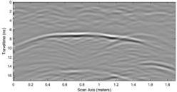

Qin et al.

10.3389/feart.2023.1340484

A

B

C

D

FIGURE 10
Schematic diagrams of fracture electrical model and corresponding B-scan grayscale images of radar signal: (A) Electrical model of air-filled fracture, (B) B-scan grayscale image of air-filled fracture, (C) electrical model of water-filled fracture, (D) electrical model of water filled fracture.

radar signal B-scan image after forward modelling is depicted in Figure 9B.

The basic model parameters are set to the same values used for the previous looseness damage filled with water. The looseness damage was randomly imported and the filling medium was replaced with air. The corresponding geoelectric model is shown in Figure 9C, and the B-Scan image of the radar signal after forward modeling is shown in Figure 9D.

It was found that strong reflection signals appear in the loose areas of the slope body. Due to the differences in the electromagnetic properties, the imaging results for the different filling media are significantly different. For the looseness area filled with air, the reflection effect of the electromagnetic waves is relatively weak, and the intensity displayed in the Bscan echo image is relatively weak. This is because the relative permittivity of the target body of the air is relatively small compared to the permittivity of the concrete. It was found that in the radar echo signal of the air-filled loose area, the signal intensity on both sides gradually decreases. In addition, the water-filled loose area exhibits more pronounced echo characteristics. The image is overall intertwined and chaotic, the damage distribution is irregular, e.g., resembling a honeycomb, and the reflection in the middle position is relatively strong. This is because in the dense bubble area, each air coordinate position produces diffraction and reflection in different directions, and the bubble position is irregular. The reflected signal undergoes several superpositions, and the area with more overlaps has more complex signals. At this time, the reflection coefficient of the electromagnetic waves passing through the water medium is less than 0, and the attenuation of the electromagnetic waves is more serious.

### 3.2.3 Crack forward simulation

Landslide fractures, fissures, and interlayer separations within lithic materials pose potential threats to the landslide's structural integrity and safety. The random distributions of the fracture width, length, and direction enable the categorization of such landslide fractures into distinct types based on their underlying causes. Irregular fractures are arbitrarily generated, filled with water, and depicted in the corresponding geoelectric model in Figure 10A. The forward model and material parameters are the same as those for the cavity forward parameters.

The model's fundamental parameters are consistent with those of the fractures filled with water, as detailed previously. Irregular fractures are introduced randomly, but the filling medium is now air, as portrayed in the corresponding geoelectric model in Figure 10C. The radar signal's B-scan image is depicted in Figure 10D.

Figures 10B, D illustrate the radar forward projection maps corresponding to fractures filled with water and air, respectively. Both models exhibit distinct reflection waves at 8 ns The phase characteristics manifest as continuous cophase axes with trends consistent with the primary horizontal fractures in the center of the fractures. The upper and lower interfaces of the fractures correspond to the strong reflection signals, and hyperbolic diffraction waves appear at both ends of the fractures, indicating conspicuous diffraction phenomena. The reflection wave amplitude of the water-filled fractures is larger, producing a strong radar signal, and the phase of the reflection wave from the water-filled fracture is inverted compared to that of the air-filled fracture.

Frontiers in Earth Science

10

frontiersin.org