Qin et al.

10.3389/feart.2023.1340484

A

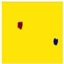

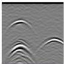

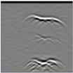

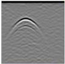

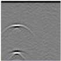

B

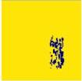

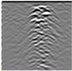

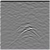

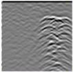

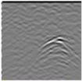

C

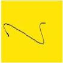

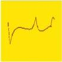

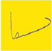

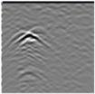

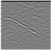

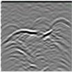

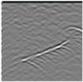

FIGURE 11
Examples from dataset. (A) Selection of examples from the cavity dataset, (B) Selection of examples from the fracture dataset, (C) Selection of examples from the fracture dataset.

### 3.3 Dataset creation

In this study, we employed the GprMax software to simulate the response of Ground Penetrating Radar (GPR) to various subsurface anomalies. The process of dataset creation involved using Python to

generate batch input files for GprMax and to execute these simulations in bulk. This method efficiently produced a comprehensive dataset, which can be utilized for training and validating machine learning models for landslide anomaly detection and characterization. The dataset comprises 700 models

Frontiers in Earth Science

11

frontiersin.org