Qin et al.

10.3389/feart.2023.1340484

A

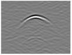

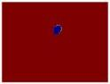

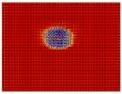

B

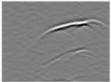

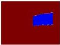

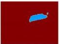

C

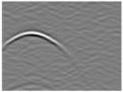

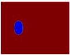

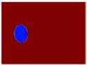

D

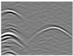

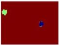

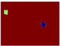

FIGURE 12
Schematic diagram of the training optimization process: (A) Epoch1, (B) Epoch50, (C) Epoch100, (D) Epoch200.

of different cavity shapes, 300 randomly generated models of unconsolidated anomalies, and 300 models of irregular fractures. Each model was processed accordingly, and pairs of model images and their corresponding echo maps were fed into the Pix2Pix network structure for training.

It is noteworthy that upon completion of batch simulation calculations for the corresponding damage models, synthesized radar data files were retrieved and subjected to pertinent preprocessing, such as the removal of direct waves, time gain, and contrast enhancement. As depicted in Figures 11–13, the red filling medium represents water, and the blue signifies air.

Upon completion of all of the simulations and the corresponding processing, the GPR data and associated damage parameters were compiled into a dataset for subsequent analysis, training, and validation of the machine learning model. By employing this method, we effectively generated an integrated dataset comprising various landslide hazards and their corresponding GPR responses. This dataset is a valuable resource for developing and evaluating advanced signal processing and

inversion techniques and can be utilized for GPR-based detection and characterization of landslide hazards.

### 3.4 Simulation results of landslide hazard inverse modeling

#### 3.4.1 Void inversion

In this study, the Pix2Pix model was utilized to reconstruct voids of various shapes, thereby achieving our goal of inverse reconstruction pertaining to landslide cavity damage.

Figure 12 illustrates the void damage, manifesting the ongoing optimization of the learning process during training. It is discernible that at epoch = 1, even for singular void damage, the images generated remain relatively indistinct and significantly deviate from the model images. With increasing training iterations, the images produced by Pix2Pix begin to increasingly converge with the images used for the training, ultimately tending towards consistency, and they still yield a relatively precise outcome for dual void damage.

Frontiers in Earth Science

12

frontiersin.org