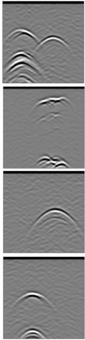
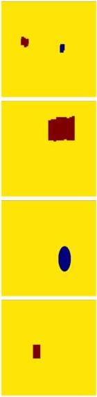
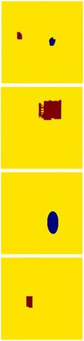

Qin et al.

10.3389/feart.2023.1340484

A

B

C

FIGURE 13
Cavity inversion results (epoch = 200): (A) B-scan images, (B) model images, (C) inversion results.

The inversion results for the landslide void damage are displayed in Figure 13. The corresponding model images of the landslide void damage are shown in Figure 13B, and the echo conditions of the void damage acquired through respective forward simulation using gprMax are illustrated in Figure 13A. Figure 13C depicts the inversion results derived from feeding the images in Figure 13A into the well-trained network. After 200 training iterations, it is evident that the Pix2Pix network model can precisely invert the target structure of the void damage while accurately inverting both the water and air within the voids. Nonetheless, it is not difficult to discern that the inversion effects of the irregular void damage are relatively subpar compared to those of regular voids, such as circular

and rectangular shapes, and the inversion results exhibit more pronounced discrepancies from the original model. However, the overall inversion effect is commendable and effectively distinguishes the corresponding target structures and substance properties represented by the radar echo characteristics of the void damage.

#### 3.4.2 Loose material inversion

The inversion results pertaining to unconsolidated damage are depicted in Figure 14. Figure 14B presents the model image of the unconsolidated damage, Figure 14A shows the echo characteristics of the unconsolidated damage obtained after forward simulation, and Figure 14C displays the inversion results. After 200 training

Frontiers in Earth Science

13

frontiersin.org