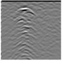
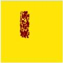
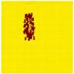
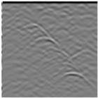
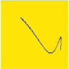
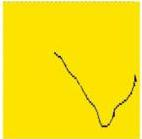
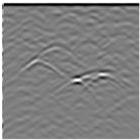
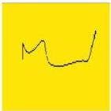
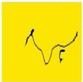

Qin et al.

10.3389/feart.2023.1340484

A

B

C

FIGURE 14
Uncompacted zone inversion result (epoch = 200): (A) B-scan images, (B) model images, (C) inversion results.

A

B

C

FIGURE 15
Fracture inversion result (epoch = 200): (A) B-scan images, (B) model images, (C) inversion results.

iterations, it is apparent that the Pix2Pix network model can, with reasonable precision, invert the target structure of the landslide unconsolidated damage under water-rich conditions. However, the overall effect is not as satisfactory as the previously discussed results for the void damage, and the cause of such a discrepancy may lie in the relative complexity and irregular shape of the unconsolidated damage.

#### 3.4.3 Crack inversion

The inversion results pertaining to the fissure damage are presented in Figure 15. Figure 15B presents the model images of the inflated fissure damage, Figure 15A displays the corresponding B-scan radar echo characteristics of the fissures obtained after forward simulation, and Figure 15C shows the inversion results. After 200 training iterations, the Pix2Pix network model yields a notable inversion effect for the target structure of the landslide

fissure damage. The fissure locations in the inversion images essentially coincide with those in the original images, and the shape structure of the obtained fissures also fundamentally aligns with the original model, yielding satisfactory inversion results.

## 4 Conclusion

In this study, we addressed the detection of landslide damage via GPR, constructed geoelectrical models of landslide soil and rock mass damage, such as voids, unconsolidated materials, and fissures, based on heterogeneous media, and analyzed the forward radar signals under diverse working conditions. By employing deep learning techniques, the Pix2Pix generative adversarial network was utilized to intelligently invert the GPR data. The echo characteristics of the voids were manifested as downward-

Frontiers in Earth Science

14

frontiersin.org