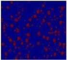
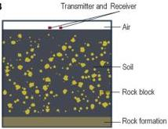

Qin et al.

10.3389/feart.2023.1340484

A

B

FIGURE 1
Schematic diagram of soil-rock mixed medium modeling: (A) Diagram of randomly generated rock fragments, (B) soil-rock medium model.

TABLE 1 Parameters for forward modeling of the model.

|  Medium | Relative permittivity | Conductivity (s/m) | Magnetic permeability μr (h/m)  |
| --- | --- | --- | --- |
|  Air | 1 | 0 | 1  |
|  Soil | 25 | 0.001 | 1  |
|  Water | 81 | 0.00001 | 1  |
|  Stone block | 7 | 0.001 | 1  |

discretization interval are not arbitrarily selected. They must meet certain conditions to limit the numerical dispersion to the minimum range. Talflove (Umashankar and Taflove, 1982) conducted an in-depth study and research on the differential grid algorithm and provided the limiting conditions for the temporal discretization interval \(\Delta t\) and the spatial discretization intervals \(\Delta x\), \(\Delta y\), and \(\Delta z\):

\[
\Delta t \leq \frac {1}{c \sqrt {\frac {1}{(\Delta x) ^ {2}} + \frac {- 1}{(\Delta y) ^ {2}} + \frac {1}{(\Delta z) ^ {2}}}} \tag {1}
\]

where c is the speed of light in vacuum (m/s).

Eq. 1 represents the Courant stability condition, which indicates the corresponding relationship between the spatial discretization and temporal discretization when the numerical dispersion is limited to the minimum range.

Generally, we divide the Yee grid evenly to simplify the calculations and select a discrete spatial step length. Eq. 1 can be simplified as follows:

\[
\Delta t \leq \frac {\Delta l}{c \sqrt {3}} \tag {2}
\]

The discretization of the continuous Maxwell's equations inevitably results in electromagnetic pulse wave dispersion, leading to calculation errors or even divergence. To reduce the impact of the numerical dispersion, we typically select a spatial discretization step length of less than \(\lambda /10\) of the electromagnetic wavelength to enhance the stability of the numerical solution.

#### 2.1.3 Selection of excitation sources

In performing TDFD simulations of GPR data, the selection of an appropriate excitation source is critical. The Ricker wavelet is a

pulse signal that is widely used in seismology and is suitable for detecting underground media with different permittivities. The Ricker wavelet is a broadband, nonperiodic pulse signal commonly employed in seismic prospecting and geological detection. The mathematical expression of the Ricker wavelet is as follows:

\[
s (t) = \left(1 - 2 \pi^ {2} f _ {0} ^ {2} (t - t _ {0}) ^ {2}\right) e ^ {\left(- \pi^ {2} f _ {0} ^ {2} (t - t _ {0}) ^ {2}\right)} \tag {3}
\]

where  \( f_{0} \)  is the dominant frequency, and  \( t_{0} \)  is the central moment of the waveform. After Fourier transformation, it is as follows:

\[
F (f) = \frac {2 f ^ {2}}{\sqrt {\pi} f _ {m} ^ {2}} e ^ {- \frac {f ^ {2}}{f _ {m} ^ {2}}} \tag {4}
\]

#### 2.1.4 Absorbing boundary conditions

In the TDFD simulation of GPR data, absorbing boundary conditions (ABCs) are a technique used to handle reflections at the boundaries of the computational domain. Since the field values at the boundaries of the computational domain inevitably reflect back during the computation, if these reflected waves are not treated, they can lead to bias and instability in the simulation results. The PML is currently the most widely used ABC, and it is capable of effectively absorbing waves with all angles and frequencies and is suitable for various computational conditions and models.

In actual computations, the PML absorption boundary condition usually consumes more computational resources than other ABCs, but it can effectively reduce the size of the computational area while ensuring computational accuracy, thereby improving the computational efficiency. In this paper,

Frontiers in Earth Science

04

frontiersin.org