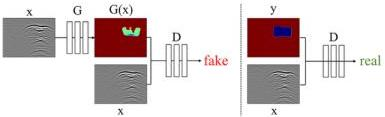
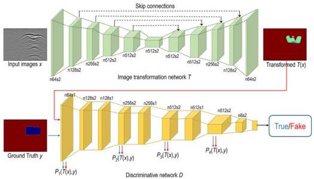

Qin et al.

10.3389/feart.2023.1340484

FIGURE 2
Training procedure.

FIGURE 3
Pix2Pix network architecture.

the PML absorbing boundary condition is used in the numerical simulations.

## 2.2 Pix2Pix neural network

### 2.2.1 Basic principles of Pix2Pix

Pix2Pix is a type of conditional generative adversarial network (cGAN) primarily aimed at learning the mapping relationship from input images to output images. The Pix2Pix network consists of two main components: a generator and a discriminator. These components work in coordination during the learning process to achieve the desired image-to-image transformation.

The objective in training the generator, denoted as G, is to produce outputs indistinguishable from real images for a discriminator, denoted as D, that has been trained adversarially. The discriminator, D, is tasked with maximizing its proficiency in

identifying the fake images from the generator. This training process is illustrated in Figure 2.

The learning process in Pix2Pix involves training the generator and the discriminator in an adversarial manner. This learning process can be summarized as follows. The generator receives an input image and generates an output image. The discriminator handles the input image paired with the generated output image or the real output image. The generator is trained to minimize the likelihood that the discriminator can correctly identify its generated output image as a fake image. The discriminator is trained to maximize the probability of correctly classifying real and fake output images. This adversarial training process continues until a state of equilibrium is reached, at which point the output image generated by the generator is highly similar to the real output image, and the discriminator can no longer accurately distinguish between real and fake output images.

In the application of GPR image inversion, the Pix2Pix deep learning framework shown in Figure 3 can provide an effective

Frontiers in Earth Science

05

frontiersin.org