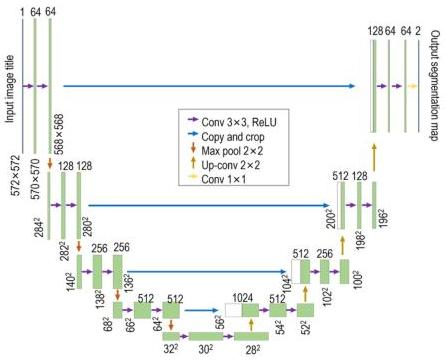

Qin et al.

10.3389/feart.2023.1340484

FIGURE 4
U-net network architecture.

means of learning the nonlinear mapping between the GPR data and the corresponding dielectric constant model, potentially enhancing the accuracy and efficiency of the inversion process.

### 2.2.2 Pix2Pix structure in GPR inversion

As depicted in Figure 4, the generator in Pix2Pix employs U-Net (Ronneberger et al., 2015), a network structure extensively used in the field of image segmentation. The principal advantage of U-Net lies in its capability to fully incorporate features. This is achieved through its unique skip connections, which allow the model to capture both local and global context information. The utilization of U-Net within the Pix2Pix model enhances the image transformation capability as the generator can better retain the fundamental features and structures in the translated images.

The discriminator within the Pix2Pix model employs the PatchGAN architecture. In contrast to traditional discriminators that evaluate the authenticity of the entire input image, PatchGAN operates on a per-pixel basis and predicts the probability values for each N×N sized region of the input image (Figure 5). The primary advantage of PatchGAN is its ability to capture more detailed image nuances and maintain the local structures in the image. By assessing the authenticity of smaller image pixels, the discriminator can effectively enforce a higher level of consistency within the generated images while maintaining a computationally efficient architecture. This approach enables better differentiation between real and fake images, enhances the training stability, and increases the convergence speed.

## 2.3 Hardware and software configuration

The production of the forward simulation dataset and the configuration of the relevant inversion learning training environment are depicted in Table 2. The performance of the graphics card significantly impacts the GPR forward simulation based on gprMax, the production of the related dataset, and the inversion of landslide hazard structure targets based on Pix2Pix. By employing the appropriate configuration for graphics processing unit (GPU) acceleration, the computational time can be substantially reduced.

## 3 Results

### 3.1 Data processing

#### 3.1.1 Time gain processing

The characteristics of GPR signals, particularly their amplitude, tend to decrease rapidly when penetrating the ground, which can negatively affect the visibility of deep and shallow reflections. Therefore, it is crucial to calibrate or apply time gain to these signals to maintain their visibility at various depths. Time-gain calibration methods based on models are essential for ensuring the fidelity of GPR data and minimizing potential signal confusion. After undergoing nonlinear time

Frontiers in Earth Science

06

frontiersin.org