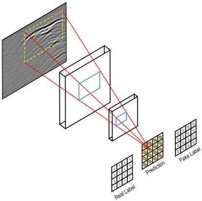

Qin et al.

10.3389/feart.2023.1340484

FIGURE 5
Schematic diagram of PatchGAN.

TABLE 2 Configuration of the experimental environment.

|  Software | System | Win11  |
| --- | --- | --- |
|   |  Dependency | Cv2, Numpy, Torch  |
|   |  Language | Python  |
|   |  Deep learning framework | PyTorch  |
|  Hardware | Processor | Intel core i9-12900H  |
|   |  Graphics card | NVIDIA GEFORCE GTX3060M  |
|   |  RAM | 32G  |
|   |  Hard disk | 1T  |

gain processing, the form of the signal significantly changes (Figure 6). Generally, the energy variation of electromagnetic waves obeys an exponential law. Therefore, the time gain function is chosen in the form of exponential gain:

\[
y = a ^ {x} - 0. 5 \tag {5}
\]

where x is the sampling rate or time.

Generally, an upper limit is set for the maximum value of the time gain function, which should not increase indefinitely.

Figure 6 illustrates a case where the maximum gain is limited to 40.

As illustrated in Figure 6, the original radar signal waveform appeared relatively flat, with minimal variation in color, indicating a fairly uniform signal intensity across the entire detection range. However, after the application of time gain adjustments, the waveform exhibits more detailed and varied structural changes. The color variation becomes more pronounced, indicating significant changes in signal intensity. Moreover, the color scale of this image displays a signal intensity range from -1,000 to 1,500, which is broader than that of the original image, suggesting that the revised image offers greater signal contrast.

#### 3.1.2 Removal of direct arrival wave

A common problem when analyzing GPR data is the presence of a direct wave. The direct wave is a signal that propagates directly from the transmitting antenna to the receiving antenna without interacting with the ground. The direct wave is usually the largest and strongest signal in the GPR data, and it masks other signals from underground features. To accurately analyze underground features using GPR, the direct wave must be deleted from or minimized in the GPR data. In this paper, the direct wave is physically eliminated by modifying the GPR system (Figure 7).

Frontiers in Earth Science

07

frontiersin.org