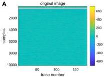
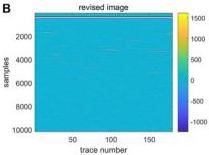
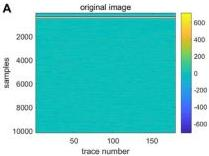
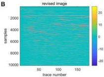

Qin et al.

10.3389/feart.2023.1340484

FIGURE 6
Comparison of signal before and after time gain application: (A) Before gain application, (B) before gain application.

FIGURE 7
Comparison of the signal before and after the removal of the direct wavefront: (A) Before removal of the direct arrival wave, (B) After removal of the direct arrival wave.

As can be seen from Figure 7, by eliminating the direct wave, the signals from underground features become clearer and easier to identify, which leads to a more accurate and reliable interpretation. In addition, removing the direct wave helps reduce the noise and improve the signal-to-noise ratio of the GPR data, thereby enhancing the sensitivity of the GPR to subtle underground features. Overall, the removal of the direct wave is an important step in GPR data processing and can significantly improve the accuracy and reliability of underground surveys.

### 3.2 Simulation results of landslide hazard forward modeling

#### 3.2.1 Void forward simulation

Void damage in landslides refers to the cavities or open spaces formed within the soil–rock mixture. The formation of voids in landslide is typically attributed to several factors: groundwater, excessive rainfall and snowmelt, and plant roots penetrating the rocks and soil. Differences in the inducing factors and environmental conditions lead to variations in the size, shape, and distribution of voids, the presence of which jeopardizes the structural stability and safety of landslides.

The forward model of the void is defined with dimensions of 2 m×1 m, a grid division of 0.002 m×0.002 m, a PML absorption boundary of 10 grids, and a time window of 20 ns The Ricker wavelet is selected, the antenna frequency is set to 800 MHz, the coordinates of the transmitting antenna are (0.02, 0.95), and the coordinates of the receiving antenna are (0.10, 0.95). The antenna movement step is 0.01 m, and the time step is 0.01 ns Two irregular circular voids area separately filled with air and water. The background soil material properties are ε=9 and σ=10–6; the air parameters are ε=1 and σ=0; and the stone parameters are ε=7 and σ=0.001. As previously discussed, the stone modeling method for soil–rock mixtures was leveraged for the stone modeling. The geoelectric model is depicted in Figure 8A.

Figure 8B shows that in the corresponding GPR scan images, the forward simulation of the landslide cavities invariably manifests as hyperbolic waveforms that open downward. The apex of the hyperbolic waveform corresponds to the peak of the reflected amplitude, and the amplitude on both sides is relatively subdued. Owing to the disparities in the electromagnetic characteristics, different filling media result in significant differences in the cavity imaging results. For the cavities filled with air, the hyperbolic feature of the imaging and the echo feature corresponding to the upper and lower boundaries of the cavity are fairly conspicuous. This is because the relative permittivity of the

Frontiers in Earth Science

08

frontiersin.org