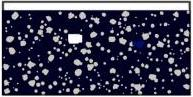
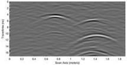
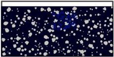
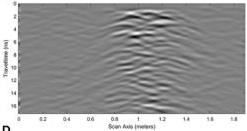
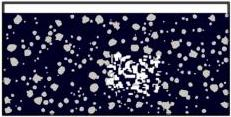
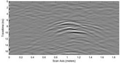

Qin et al.

10.3389/feart.2023.1340484

A

B

FIGURE 8
Schematic of landslide slope cavity model and B-scan: (A) Electrical model diagram of cavity, (B) B-scan grayscale image of cavity.

A

B

C

D

FIGURE 9
Schematic diagram of uncompacted electrical model and corresponding B-scan grayscale image of radar signal: (A) Electrical model of water-filled uncompacted zone, (B) B-scan grayscale image of water-filled uncompacted zone, (C) electrical model of air-filled uncompacted zone, (D) B-scan grayscale image of air-filled uncompacted zone.

air-filled target is relatively close to that of the soil and rock, resulting in a relatively weak reflection of the electromagnetic waves and thus a relatively low intensity on the B-scan echo graph. However, the water-filled cavities exhibit prominent imaging hyperbolic features and multiple wave reflections. This is because the vast difference in the dielectric properties of water and the geological environment lead to a stronger ability to reflect electromagnetic waves, which is manifested as prominent high intensity features in the radar cross-section.

Regarding the two types of cavities filled with different media, the reflection wave amplitude of the water-filled cavities is larger, and the reflection wave amplitude of the air-filled cavities is smaller. Moreover, when comparing the reflection waves of the water-filled cavities and air-filled cavities, a phase reversal occurs. It can also be observed that waveform trailing occurs after the cavity reflection wave. This is due to the scattering coherence caused by the defect's

edges, coupled with multiple reflections of the radar wave within the defect and their superposition.

By examining these amplitude and phase changes, we can assess the electrical differences and determine the nature of the cavity damage.

### 3.2.2 Loose material forward simulation

The loosening or nonadherence between disparate layers of lithic materials defines the lack of compactness within the slope, which jeopardizes the structural integrity of the landslide, thereby instigating potential safety hazards. The defects caused by non-compactness are epitomized by the creation of multiple randomly arrayed diminutive cuboidal cavities, which are areas filled with water or air. The associated geoelectric model is illustrated in Figure 9A, and the forward model and material parameters are the same as those of the cavity forward parameters. The resultant

Frontiers in Earth Science

09

frontiersin.org