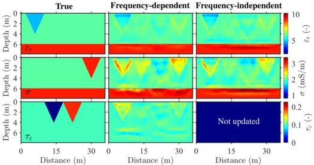
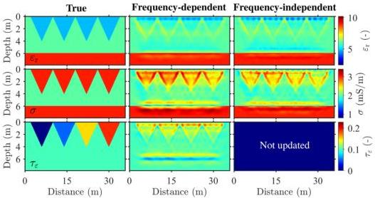

FWI of GPR data in frequency-dependent media

513

Figure 5. Models of the three-parameter synthetic example where all anomalies are spatially uncorrelated. Gaussian noise (SNR = 20 dB) is added to the observed data. The three columns are the true models, the frequency-dependent GPR FWI results and the frequency-independent GPR FWI results ($\varepsilon_r$ and $\sigma$), respectively.

Figure 6. Models of the three-parameter synthetic example where all anomalies are spatially correlated. Gaussian noise (SNR = 20 dB) is added to the observed data. The three columns are the true models, the frequency-dependent GPR FWI results and the frequency-independent GPR FWI results ($\varepsilon_r$ and $\sigma$), respectively.

performance in terms of reconstructing the permittivity model. The estimation of the conductivity perturbation deteriorates from left to right as permittivity attenuation increases. Besides, frequency-dependent GPR FWI shows more in-trench reconstructions than frequency-independent GPR FWI. In the frequency-independent GPR FWI results, the upper boundary of the last conductivity trench becomes discontinuous and only the two sides can be distinguished. On the contrary, frequency-dependent GPR FWI still reconstructs the four conductivity trenches with good resolution, although the first two trenches in the permittivity attenuation model are incorrectly estimated.

### 4.2.2 Two-parameter model

We perform another two tests to investigate the crosstalk of different parameters in the GPR FWI. Fig. 7 shows the same true models of $\varepsilon$ and $\tau_\varepsilon$ as Fig. 6. The static conductivity model is adjusted so that the conductivity model is unchanged. The increasing values of $\tau_\varepsilon$ from the left to the right trench means that the percentage of $\tau_\varepsilon$ in permittivity increases from 0 to 10 per cent. We observe heavy crosstalks between $\tau_\varepsilon$ and $\varepsilon$ in the results of frequency-dependent GPR FWI. The four permittivity attenuation trenches are described as high-value anomalies, and the four permittivity trenches are recovered to different degrees. For example, the last trench is reconstructed better than the first one, even

Downloaded from https://academic.oup.com/gj/article/232/1/504/6670780 by KIT Library user on 25 October 2022