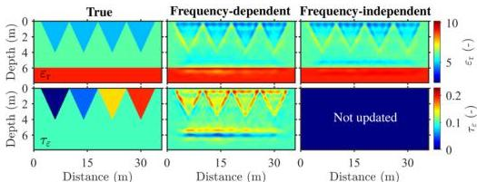
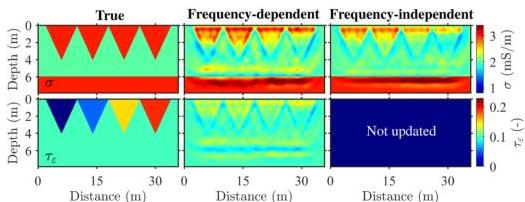

514 T. Qin, T. Bohlen and N. Allroggen

Figure 7. Models of the two-parameter synthetic example where all anomalies are caused by the static permittivity $\varepsilon_s$ and permittivity attenuation $\tau_s$. Gaussian noise (SNR = 20 dB) is added to the observed data. The three columns represent the true models, the frequency-dependent GPR FWI results and the frequency-independent GPR FWI result ($\varepsilon_r$), respectively.

Figure 8. Models of the two-parameter synthetic example where all anomalies are caused by the static conductivity $\sigma_s$ and permittivity attenuation $\tau_s$. Gaussian noise (SNR = 20 dB) is added to the observed data. The three columns represent the true models, the frequency-dependent GPR FWI results and the frequency-independent GPR FWI result ($\sigma$), respectively.

though they have the same value in the true model. This should attribute to the more realistic dispersion and attenuation in the last trench. These differences also occur in the permittivity result of frequency-independent GPR FWI. Since the small effect of $\tau_s$ on the phase velocity (see Fig. 2c), the permittivity results obtained from frequency-dependent GPR FWI has only a slight improvement compared to that from frequency-independent GPR FWI (Fig. 7).

When it comes to the synthetic example of $\sigma$ and $\tau_s$ shown in Fig. 8, we adapt the static permittivity to make permittivity the same as the background values. Although four conductivity anomalies look the same in the true model, they are combinations of different static conductivity and permittivity attenuation. The percentage of $\tau_s$ in these conductivity anomalies increase from 0 in the first one to 75 per cent in the last one. We observe severe interference of conductivity on permittivity attenuation in the results of frequency-dependent GPR FWI, where all $\tau_s$ anomalies are reconstructed as high values. Similar to that shown in Fig. 6, it is difficult for frequency-independent GPR FWI to recover the conductivity anomalies dominated by permittivity attenuation. In the permittivity attenuation model reconstructed by frequency-dependent GPR FWI, the conductivity model introduces crosstalks that become weaker with depth (Fig. 8), while the permittivity model causes crosstalks around the trench boundaries and soil–rock interface (Fig. 7). It is due to different sensitivity kernels of permittivity and conductivity in FWI (Meles et al. 2011). Therefore, in Fig. 6, we observe a superposition of these effects when reconstructing three parameters simultaneously.

## 5 INVERSION OF FIELD DATA

### 5.1 Data acquisition and pre-processing

We conducted field measurements at the northeast corner of the gliding airfield in Rheinstetten, Germany. This test site is well known from previous GPR and seismic studies (Schaneng 2017; Wegscheider 2017; Pan et al. 2018, 2021; Wittkamp et al. 2019; Gao et al. 2020; Irnaka

Downloaded from https://academic.oup.com/gj/article/232/1/504/6670780 by KIT Library user on 25 October 2022