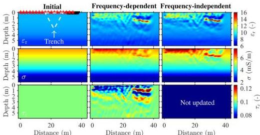

FWI of GPR data in frequency-dependent media 515

**Figure 9.** Models of the field data example in the Rheinstetten test site. The three columns are the initial models, the frequency-dependent GPR FWI results and the frequency-independent GPR FWI results, respectively. The white dashed triangle in the initial model outlines the target trench, known as the Ettlinger Line. The red stars are the transmitters, and the dense black triangles are the receivers of the 16th transmitter.

**Table 2.** Acquisition parameters of the surface GPR data (200 MHz) in the Rheinstetten test site and those used within the FWI.

|  Parameters | Raw | FWI  |
| --- | --- | --- |
|  Number of sources | 165 | 18  |
|  Traces per gather | 56–125 | 100–175  |
|  Transmitter spacing | ~ 0.2 m | 2 m  |
|  Receiver spacing | ~ 0.1 m | 0.04 m  |
|  Minimum offset | 0.2 m | 0.3 m  |
|  Maximum offset | 17 m | 8 m  |
|  Sample rate | 0.2 ns | 0.08 ns  |
|  Recording window | 200 ns | 164 ns  |

*et al.* (2022). It is covered by sediments consisting of gravel and sand from the Rhine river. The ground layer is composed of partially saturated soil. At the test site, a defensive “V” shaped trench named Ettlinger Line (dashed triangle in Fig. 9) was built in the early 17th century and has been refilled and is now completely flattened to the surface. The existence and shape of the Ettlinger Line have been delineated in detail via 3-D GPR migration imaging (Wegscheider 2017), 3-D Rayleigh-wave dispersion inversion (Schaneng 2017; Pan *et al.* 2018), 2-D joint elastic FWI of Rayleigh and Love waves (Wittkamp *et al.* 2019), 2-D viscoelastic FWI of Rayleigh waves (Gao *et al.* 2020), and 3-D viscoelastic FWI of the surface waves (Pan *et al.* 2021; Irnaka *et al.* 2022).

The surface GPR profile is positioned perpendicular to the Ettlinger Line. The two ends of the profile (from southwest to northeast) are in the same location as ‘C’ and ‘B’ in fig. 1(a) in Pan *et al.* (2018). The acquisition settings for the surface GPR data are listed in Table 2. Our GPR data were recorded using a single-channel pulseEKKO Pro GPR system equipped with a pulseEKKO Ultra receiver. The Ultra receiver stacked the records 256 times to obtain a higher SNR by reducing the random noise. The nominal centre frequency of the transmitter is 200 MHz. We deployed the transmitter–receiver orientation in HH mode to acquire TM wave data. The receiver was mounted on a sledge for smooth movement and tracked at the centimetre level by employing a real-time kinematic (RTK) positioning using a self-tracking total station as presented by Boniger & Tronicke (2010). To obtain multioffset GPR data for one source, we fixed the transmitter and moved the receiver towards the transmitter. Then we changed the transmitter location and moved the receiver away from the transmitter to produce the next gather. It took us two minutes to record one radargram and six hours for all 165 radargrams. Our measurements were slower than those of Lavoué (2014) who extracted hundreds of multioffset gathers from 15 common-offset gathers with an offset interval of 0.5 m. However, each trace in the multioffset GPR data used in Lavoué (2014) might be generated by a different transmitter-ground coupling. In contrast, our measurement had the same transmitter-ground coupling in one gather and had denser receiver intervals (~0.1 m).

In order to apply the FWI, we have to pre-process the GPR data first. The steps for data pre-processing are listed in Table 3, similar to those used in Domenzain *et al.* (2021). Due to the uneven walking speed of the worker when moving the sledge, the data we acquired has irregular trace spacing. To ensure a balanced illumination in the measurement area, we apply the data gridding, that is 2-D spline interpolation in the time-offset domain at regular trace spacing. Finally, we transform the data acquired in the 3-D world into 2-D line-source data because

Downloaded from https://academic.oup.com/gj/article/232/1/504/6670780 by KIT Library user on 25 October 2022