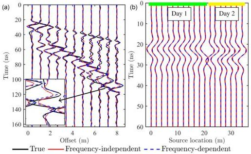

FWI of GPR data in frequency-dependent media

517

Figure 10. (a) Data fitting of the 16th radargram of the field data example in the Rheinstetten test site, shown once every 20 traces. Each trace is divided by the maximum amplitude of each trace of the observed data. The rectangular window shows the zoomed waveforms. (b) Estimated source signals of two FWIs. The green and yellow lines mark the sources used on different days. A Butterworth bandpass filter (5–100 MHz in the fifth stage) is applied to the radargrams.

behaviour with respect to azimuth (Yao et al. 2018). Another strategy is to use the Hessian operator computed by Newton's method in optimization (Métivier et al. 2013; Operto et al. 2013; Gao et al. 2021). Truncated Newton method has been employed in frequency domain GPR FWI by Pinard et al. (2015). When it is introduced to the time domain GPR FWI, we have to find a balance between the elimination of crosstalk and the increase in computational cost, which needs further investigation.

Previous studies have shown the potential of joint inversion because other data can provide some complementary information to the GPR inversion (Linde et al. 2008; Domenzain et al. 2020; Qin et al. 2022). For example, the electrical resistivity (ER) data are sensitive to electrical conductivity. Therefore, the joint inversion of GPR and ER data may help to improve the reconstruction of conductivity (Domenzain et al. 2021). Note that the estimated conductivity is frequency-dependent in our GPR FWI, but frequency-independent in the ER inversion. Transformation of the two can be achieved by eq. (13), but depends on the reliability of the permittivity attenuation reconstruction, which requires further improvement in the future.

## 7 CONCLUSION

In this paper, we quantified permittivity attenuation for EM wave propagation simulator using the τ-method introduced from the seismic community, which not only saves memory and reduces computations in forward modelling but also simplifies the constant Q approximation and frequency-dependent GPR FWI. By defining the parameter ττ, we proposed a new form of time-domain Maxwell's equations to describe the propagation of EM waves in frequency-dependent media. These equations have two advantages in GPR FWI. The first one is their self-adjoint property, which allows performing frequency-dependent GPR FWI without changing the backpropagation engine. The second advantage is that the model gradients derived from these equations are fairly simple, ensuring as few modifications as possible to the existing frequency-independent GPR FWI code. Frequency dependence analysis revealed that, in the GPR spectrum range, the attenuation caused by the static conductivity is frequency-independent, while that caused by ττ is frequency-dependent. The permittivity attenuation acts as a low-pass filter and leads to waveform deformation and less amplitude decay of EM waves.

The 2-D synthetic examples confirmed the effectiveness and limitations of frequency-dependent GPR FWI. The spatially uncorrelated examples indicated that surface multioffset GPR data are weakly sensitive to permittivity attenuation compared to permittivity and conductivity. They also demonstrated that both frequency-dependent GPR FWI and frequency-independent GPR FWI suffer heavy crosstalk of different parameters. The spatially correlated examples showed that frequency-dependent GPR FWI works well in estimating the permittivity and conductivity models coupled with different permittivity attenuation levels, and frequency-independent GPR FWI produces comparable permittivity results as the dispersion effect is weak. Although combined with STF estimation, frequency-independent GPR FWI cannot handle the reconstruction of conductivity anomalies dominated by permittivity attenuation. In this case, frequency-dependent GPR FWI can provide more reliable conductivity results even if the permittivity attenuation models fail to be estimated and the observed data contain a

Downloaded from https://academic.oup.com/gj/article/232/1/504/6670780 by KIT Library user on 25 October 2022