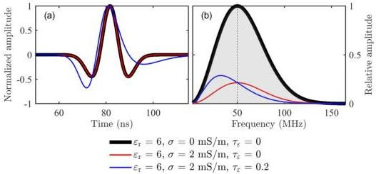

FWI of GPR data in frequency-dependent media

509

Figure 1. (a) Radargrams generated by a shifted 50 MHz Ricker source in 1-D homogeneous media and obtained by the receiver 10 m offset away from the source. The traces are normalized by their maximum amplitudes. (b) Corresponding amplitude spectra. The spectra are divided by the maximum amplitude of the thick black line. The translucent grey area represents the amplitude spectrum of the source wavelet, and the thin dashed line marks the peak frequency. One relaxation mechanism is used when $\tau_{\varepsilon} = 0.2$ (the blue line).

### 3 FREQUENCY DEPENDENCE ANALYSIS

In order to analyse the effect of different model parameters on EM wave propagation, we make a comparison experiment using the 1-D analytical solution of EM wave in homogeneous media (Blanch et al. 1995). As shown in Fig. 1, we discuss three kinds of typical media in this section. All media have the same relative permittivity ($\varepsilon_{r} = 6$) so that the signals at the reference frequency propagate with the same phase velocity. The latter two attenuating media have the same conductivity ($\sigma = 2 \text{ mS m}^{-1}$) in order to generate the same attenuation level at the reference frequency. We take the wave propagation in a non-attenuating medium as a reference (the thick black line). One relaxation mechanism is employed in frequency-dependent medium where $\tau_{\varepsilon} = 0.2$ and $\sigma_{\varepsilon} = 0.1 \text{ mS m}^{-1}$. Thus, according to eq. (13), the permittivity attenuation $\tau_{\varepsilon}$ dominates the conductivity (95 per cent) and contributes to the permittivity slightly (10 per cent) at the reference frequency. We set the relaxation time of the conductivity $\tau_{\sigma} = 0$ s in this paper so that we can focus more on the effect of $\tau_{\varepsilon}$ on the data. The value of $\tau_{\varepsilon}$ is chosen to approximate a constant $Q (= 10)$ which has been observed in some geological materials (Turner & Siggins 1994).

Compared to the reference medium, the attenuating media lead to a significant decrease in amplitude in Fig. 1(b). We observe different waveform and amplitude decreases in the frequency-dependent medium (the blue line) where $\tau_{\varepsilon}$ works as a low-pass filter, with more attenuation at frequencies above the peak frequency and less attenuation in the other frequency ranges. This is presented as a shift of the amplitude spectrum towards lower frequencies in Fig. 1(b), corresponding to the waveform deformation in Fig. 1(a). In contrast, the conductivity attenuation medium scales the amplitude of different frequencies equally, without changing the waveform shape.

To find the reasons of these phenomena, we show the phase velocity $v$, attenuation factor $\alpha$ and quality factor $Q$ with respect to frequency in Figs 2(a)–(c). Those three characteristics are computed from the real effective parameters shown in Figs 2(d) and (e) through eq. (14). The reference medium has infinite $Q$ value, no attenuation, and a constant velocity. Along with the dominant frequency range of the source wavelet (25–80 MHz), the conductivity attenuation medium has a linear increase of the quality factor, almost the constant attenuation level, and similar velocity with the reference medium due to that the transition frequency ($\approx 6$ MHz) is much smaller than the peak frequency of the source wavelet (50 MHz). That results in almost identical travel time and amplitude changes of different frequency components in Fig. 1. Unlike the frequency-independent media, the frequency-dependent medium causes both phase velocity and attenuation factor to increase with frequency in the dominant frequency region, which is the reason for distorting the waveform and amplitude spectrum in Fig. 1. Although we use only one relaxation mechanism, the $Q$ approximated is close to the desired value. With more relaxation mechanisms, the $Q$ approximation can be further improved. As shown in Figs 2(d) and (e), dielectric permittivity and electrical conductivity are frequency-independent in the reference medium and conductivity attenuation medium and become frequency-dependent in the permittivity attenuation medium. When the frequency is greater than 25 MHz, the conductivity is proportional to the attenuation factor, and the permittivity is inversely proportional to the square of phase velocity.

### 4 INVERSION OF SYNTHETIC DATA

We use several synthetic examples of 2-D models ($x$–$z$ plane) to analyse the performance of frequency-dependent GPR FWI. Transverse magnetic (TM) mode waves are used in the simulation and inversion of GPR surface recordings. In frequency-independent media, there are wavefield components $H_{x}$, $H_{y}$ and $E_{y}$ and reconstructed model parameters $\varepsilon$ and $\sigma$. In frequency-dependent media, additional memory variable $r_{vl}$ and reconstructed model parameters $\tau_{\sigma}$ and $\tau_{\varepsilon}$ are added with $L = 1$. The magnetic permeability $\mu$ is constant and equal to its value of vacuum. We set $\tau_{\sigma} = 0$ s based on the analysis in the previous section.

Downloaded from https://academic.oup.com/gj/article/232/1/504/6670780 by KIT Library user on 25 October 2022