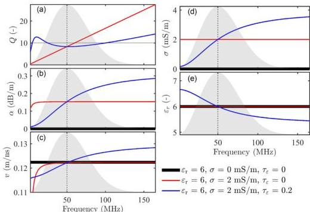
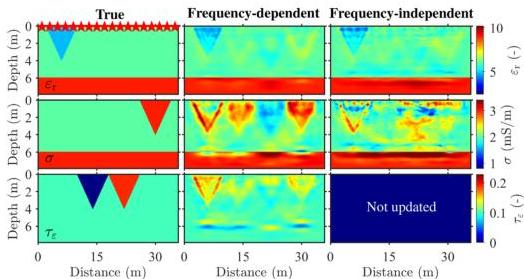

510 T. Qin, T. Bohlen and N. Allroggen

**Figure 2.** Frequency-dependent media characteristics. (a) Quality factor, (b) attenuation factor, (c) phase velocity, (d) real effective conductivity and (e) real effective permittivity. The translucent grey area represents the amplitude spectrum of the source wavelet, and the thin dashed line marks the peak frequency. The thin black line in (a) shows the desired $Q$ value ($Q = 10$). Note that $Q$ is infinite for the non-attenuating medium (the thick black line) and therefore not displayed in (a).

**Figure 3.** Models of the three-parameter synthetic example where all anomalies are spatially uncorrelated. The three columns are the true models, the frequency-dependent GPR FWI results and the frequency-independent GPR FWI results ($\varepsilon_r$ and $\sigma$), respectively. The red stars on the true model are the transmitters.

The EM model space shown in Fig. 3 is 10 m $\times$ 36 m, and the grid spacing is 0.1 m. The three-layer background parameters are set according to Table 1. As the 2-m-thick air layer above the ground is not updated during the inversion, we do not show it in the figures of this paper. The true model for the synthetic examples consists of the background model and triangular perturbations, where the permittivity perturbations are relatively weak, so that we can better study the reconstruction of the conductivity and permittivity attenuation models in the inversion. Receivers are placed on the ground at 0.2 m intervals to record the radargrams of the electric field component with a time sampling of 0.15 ns and a time window of 300 ns. Eighteen transmitters generate the electric field at 2 m intervals on the ground (see red stars in Fig. 3). The source is a shifted Ricker wavelet with a centre frequency of 50 MHz. For each source, the receivers record data with an offset of 1–20 m.

Downloaded from https://academic.oup.com/gj/article/232/1/504/6670780 by KIT Library user on 25 October 2022