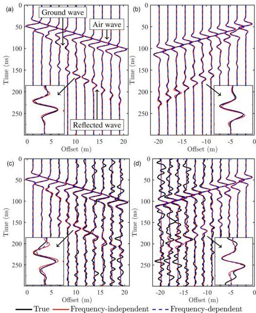

512 T. Qin, T. Bohlen and N. Allroggen

**Figure 4.** Data fitting of the three-parameter synthetic example where all anomalies are spatially uncorrelated. Gaussian noise (SNR = 20 dB) is added to the observed data in (c) and (d). (a and c) and (b and d) are the radargrams of the first and last sources, shown once every eight traces. Each trace is divided by the maximum amplitude of each trace of the observed data. The rectangular windows show the zoomed waveforms. A Butterworth bandpass filter (5–80 MHz in the fifth stage) is applied to the radargrams.

noise stabilizes frequency-independent GPR FWI and allows it to converge to better results than the noise-free case. Overall, frequency-dependent GPR FWI still possesses fewer data misfits and model artefacts than frequency-independent GPR FWI when the observed data are contaminated by noise.

## 4.2 Correlated model

### 4.2.1 Three-parameter model

In the true model of this example, the perturbations of the permittivity and conductivity models are located at the same position and have the same values in all trenches. However, the static permittivity and static conductivity in each trench are different due to the variations of the permittivity attenuation model. In Fig. 6, we see that frequency-dependent GPR FWI and frequency-independent GPR FWI have similar

Downloaded from https://academic.oup.com/gj/article/232/1/504/6670780 by KIT Library user on 25 October 2022