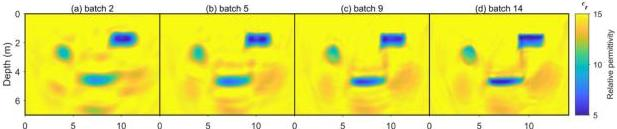
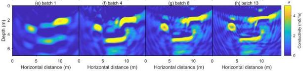
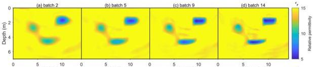
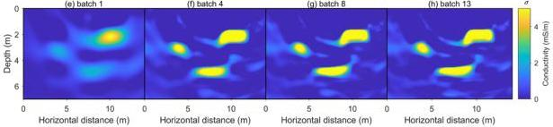

Remote Sens. 2024, 16, 4146

10 of 19

issues are significantly mitigated by using the W₂ distance (Figure 7). The target's structure is more consistent with the true model, resulting in cleaner imaging. This is attributed to the excellent convexity of the W₂ distance method and its sensitivity to low-frequency information, which helps achieve a more accurate background model and reduces the artifact interference caused by local minima.

Figure 6. The inverted images of relative permittivity and conductivity obtained from the L₂ norm method based on initial model I. (a–d) are the reconstructed relative permittivity images from frequencies in batch 1, batch 5, batch 9, and batch 14, respectively. (e–h) are the reconstructed conductivity images from frequencies for batch 1, batch 2, batch 3, and batch 4, respectively.

Figure 7. The inverted images of relative permittivity and conductivity obtained from the W₂ distance method based on initial model I. (a–d) are the reconstructed relative permittivity images from frequencies in batch 1, batch 5, batch 9, and batch 14, respectively. (e–h) are the reconstructed conductivity images from frequencies for batch 1, batch 2, batch 3, and batch 4, respectively.