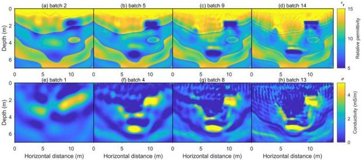
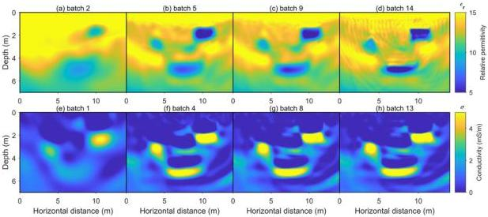

Remote Sens. 2024, 16, 4146

11 of 19

Figure 8. The inverted images of relative permittivity and conductivity obtained from the L₂ norm method based on initial model II. (a–d) are the reconstructed relative permittivity images from frequencies in batch 1, batch 5, batch 9, and batch 14, respectively. (e–h) are the reconstructed conductivity images from frequencies for batch 1, batch 2, batch 3, and batch 4, respectively.

Figure 9. The inverted images of relative permittivity and conductivity obtained from the W₂ distance method based on initial model II. (a–d) are the reconstructed relative permittivity images from frequencies in batch 1, batch 5, batch 9, and batch 14, respectively. (e–h) are the reconstructed conductivity images from frequencies for batch 1, batch 2, batch 3, and batch 4, respectively.

Figure 9 shows the inversion results using W₂ – FWI with initial model II, while Figure 8 presents the inversion results using the L₂ norm as the FWI misfit function. Comparing Figures 8 and 9, when there is a significant difference between the initial model and the true model, the traditional L₂ norm-based inversion results are heavily affected by strong artifacts, with the target obscured beneath these false artifacts. In the conductivity inversion results shown in Figure 8, the shape of the target is distorted by spurious high-frequency artifacts, especially the circular target. Figure 8a, which shows the batch 2 results, demonstrates that inversion using low-frequency data in early iterations leads to errors in