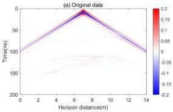
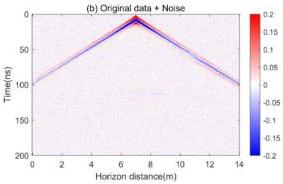
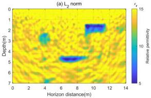
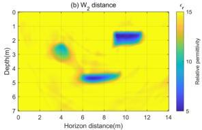
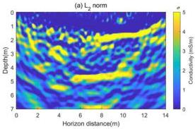
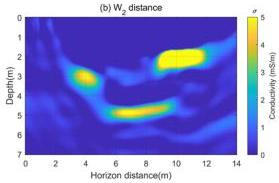

Remote Sens. 2024, 16, 4146

13 of 19

inversion using the two methods. It can be seen that in the $W_2$ distance method, the impact of random noise on the mismatch function is negligible, so the noise has minimal effect on the inversion results. However, in the traditional $L_2$ norm inversion results, there are many high-frequency artifacts that obscure the geological anomalies, significantly affecting target identification. This further demonstrates that the $W_2$ distance is insensitive to random noise. However, for other types of noise, such as high-frequency or low-frequency noise, using denoised data after processing for inversion is a more straight and effective approach.

Figure 10. (a) The original multi-offset forward simulation data with the transmitter antenna located at 7 m. (b) The image after adding random noise to the original data (a).

Figure 11. (a) The relative permittivity inversion result based on the $L_2$ norm for noisy data. (b) The relative permittivity inversion result based on the $W_2$ distance for noisy data.

Figure 12. (a) The conductivity inversion result based on the $L_2$ norm for noisy data. (b) The conductivity inversion result based on the $W_2$ distance for noisy data.