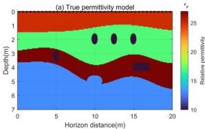
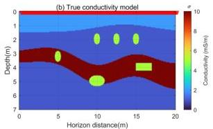
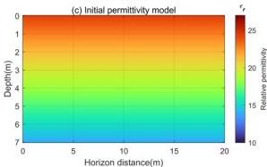
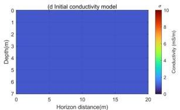

Remote Sens. 2024, 16, 4146

14 of 19

### 3.3. Example 3: Comparison of Inversion Accuracy of Complex Models

In this section, a comparison of inversion results between the $W_2$ distance and the $L_2$ norm is presented using a two-dimensional complex subsurface model. The comparison demonstrates that the $W_2$ distance provides more accurate inversion results.

The true model and initial model for this experiment are shown in Figure 13. Figure 13a depicts the relative permittivity model, while Figure 13b shows the conductivity model. The model dimensions are $20 \times 7$ m in both horizontal and vertical directions. The grid spacing is $\Delta x = 0.05$ m and $\Delta z = 0.05$ m, and the model is discretized into $N_{m2} = 400 \times 140 = 56,000$ cells. The model is divided into four layers with relative permittivity values of 25, 17, 30, and 13 and conductivity values of 2 mS/m, 1 mS/m, 10 mS/m, and 1 mS/m from the surface to the depth. The second and third layers contain rocks with relative permittivity and conductivity values of 10 and 5 mS/m, respectively. GPR multi-offset data are used for inversion in this study. The emitters, placed on the surface, are spaced 0.5 m apart, totaling 41, as shown by black stars in Figure 13a. The receiver antennas are spaced 0.1 m apart, totaling 201, as indicated by red triangles in Figure 13b. All receiver antennas record the high-frequency electromagnetic signals emitted by each transmitter, forming multi-offset data. The initial relative permittivity and conductivity models are shown in Figure 13c,d. The initial relative permittivity model increases linearly from the surface to the depth, while the initial conductivity model is uniform.

**Figure 13. (a)** True relative permittivity model. **(b)** True conductivity model. In **(a)**, red stars represent transmitter locations. In **(b)**, red triangles represent receiver locations. **(c)** Initial relative permittivity model. **(d)** Initial conductivity model.

Based on the real model, we first compute the synthetic observation data. The simulated GPR data are discretized into 15 batches, with $f_{min} = 1$ MHz and $f_{max} = 70$ MHz. Each batch contains four frequencies, and after ten iterations per batch, the frequency-domain data in the next batch are used for inversion iteration. Additionally, tests show that the iteration converges after batch 15, and frequencies above 70 MHz do not improve the