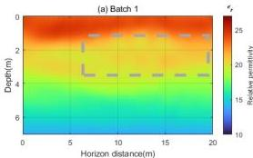
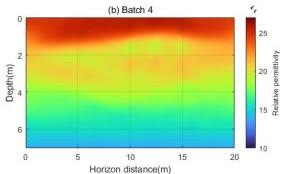
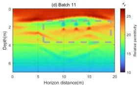

Remote Sens. 2024, 16, 4146

15 of 19

inversion results. Therefore, the highest frequency shown here is up to 70 MHz. A total of 150 iterations were performed over the 15 batches. Figure 14 shows the relative permittivity inversion results based on the $L_2$ norm, with (a)–(d) representing the inversion results for batch 1, batch 4, batch 7, and batch 11. Figure 15 displays the relative permittivity inversion results based on the $W_2$ distance, with (a)–(d) representing the inversion results for batch 1, batch 4, batch 7, and batch 11. Figure 16 presents the conductivity inversion results based on the $L_2$ norm, with (a)–(d) representing the inversion results for batch 1, batch 2, batch 3, and batch 5. Figure 17 shows the conductivity inversion results based on the $W_2$ distance, with (a)–(d) representing the inversion results for batch 1, batch 2, batch 3, and batch 5.

Comparing the relative permittivity inversion results of the two methods, it is clear that in the low-frequency batches, the $W_2$ distance provides a background value closer to the true model, resulting in more accurate final inversion results. In contrast, the $L_2$ norm, in early iterations (Figure 14a), gives incorrect positions and properties of the block targets (indicated by the gray dashed boxes), leading to significant differences between the final inversion results and the true model. Additionally, the inversion results for the third layer with high relative permittivity (low velocity layer) are notably poorer, showing larger discrepancies from the true values.

In terms of conductivity inversion results, the advantage of the $W_2$ distance is even more pronounced. Due to the low sensitivity of conductivity to amplitude variations and its higher sensitivity to low-frequency signals [4], conductivity inversion is more challenging. The point-by-point calculation method of the $L_2$ norm makes it less sensitive to low-frequency information, resulting in poorer inversion results for conductivity. On the other hand, full-waveform inversion using the $W_2$ distance better captures low-frequency information and provides more accurate conductivity inversion results. Additionally, compared to the $L_2$ norm (Figure 16a), the $W_2$ distance adjusts the background model more rapidly during the inversion process (Figure 17a).

**Figure 14.** The relative permittivity inversion images obtained by using the $L_2$ norm as the mismatch function. (a–d) represent the relative permittivity images reconstructed from frequencies in batch 1, batch 4, batch 7, and batch 11, respectively.