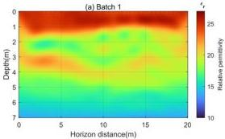
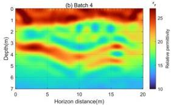
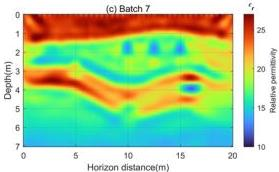
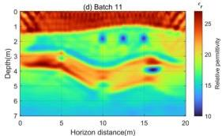
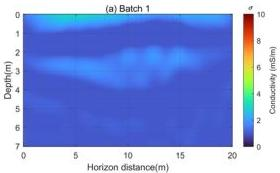
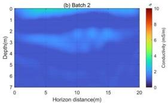
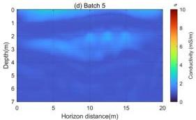

Remote Sens. 2024, 16, 4146

16 of 19

Figure 15. The relative permittivity inversion images obtained by using the W₂ distance as the mismatch function. (a–d) represent the relative permittivity images reconstructed from frequencies in batch 1, batch 4, batch 7, and batch 11, respectively.

Figure 16. The conductivity inversion images obtained by using the L₂ norm as the mismatch function. (a–d) represent the conductivity images reconstructed from frequencies in batch 1, batch 2, batch 3, and batch 5, respectively.