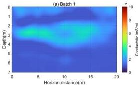
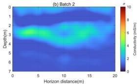
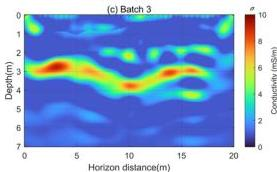
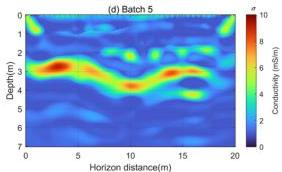

Remote Sens. 2024, 16, 4146

17 of 19

**Figure 17.** The conductivity inversion images obtained by using the $W_2$ distance as the mismatch function. (a–d) represent the conductivity images reconstructed from frequencies in batch 1, batch 2, batch 3, and batch 5, respectively.

#### 4. Discussion

In this study, to evaluate the effectiveness of the $W_2$ distance, Section 2 introduces entropy regularization and the Sinkhorn algorithm to compute the $W_2$ distance, which reduces the computational complexity of the transport matrix and improves computational speed. It also presents the objective function for GPR multi-scale frequency-domain dual-parameter full-waveform inversion when using the $W_2$ distance as the misfit function. Additionally, this paper presents a data normalization method: Softplus normalization, to ensure that the signed GPR electromagnetic wave data satisfy the non-negativity and mass equality assumptions of the $W_2$ distance. The convexity of the objective functions based on two types of normalization for the $W_2$ distance and the $L_2$ norm were compared by using a Ricker wavelet as an example. It is demonstrated that the $W_2$ distance with Softplus normalization has better convexity.

In Section 3, a multi-scale frequency-domain full-waveform inversion method is used to simultaneously invert for the relative permittivity and conductivity of GPR data. Experiment 1 shows that the $W_2$ distance is less sensitive to low-wavenumber models, reducing dependence on the initial model. Experiment 2 demonstrates that when the number of signal sampling points is sufficiently large, the $W_2$ distance is far more robust to noise compared to conventional $L_2$ norm-based FWI methods. Experiment 3 uses a complex geological model to show that the $W_2$ distance can achieve more reliable and accurate inversion results, particularly in terms of conductivity inversion.

The inherent insensitivity of the $L_2$ norm to low-frequency content is the primary reason why $L_2$ FWI often fails to recover the kinematics of the model. In contrast, the $W_2$ distance is more effective at capturing time-shift information and low-frequency data, making the objective function more convex. This property is crucial for the application of full-waveform inversion methods in situations with poor initial models, strong noise interference, and complex subsurface media. The numerical simulation results in this study