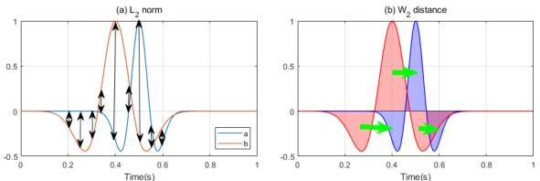

Remote Sens. 2024, 16, 4146

3 of 19

computational cost. On this basis, the Sinkhorn algorithm was proposed to solve the optimal transport problem efficiently [26]. The relaxed form of the Wasserstein distance, known as the Kantorovich–Rubinstein (KR) norm, has been proposed [21], and it does not require signals to satisfy non-negativity or mass balance conditions. Recently, the Wasserstein distance has been applied to relative permittivity inversion in asteroid radar studies [27], demonstrating its low dependency on the initial model and robustness to random noise in electromagnetic full-waveform inversion as well. The Wasserstein distance typically describes two non-negative, mass-equal signals, but seismic and electromagnetic signals shake around zero and do not meet these criteria. Therefore, certain transformations are needed to ensure that the signals satisfy the non-negativity and mass conservation conditions required for the optimal transport.

This study proposes to use the quadratic Wasserstein distance as the mismatch function in multi-scale frequency-domain full-waveform inversion for ground-penetrating radar data. The method is applied to multi-offset GPR data to simultaneously reconstruct images of subsurface relative permittivity and conductivity. The FWI objective function based on the $W_2$ distance for multi-offset GPR and the Sinkhorn optimization iteration algorithm are proposed, followed by the convexity analysis comparing the $L_2$ norm and $W_2$ distance under different scaling methods. Three numerical simulation examples demonstrate that FWI based on the $W_2$ distance suffers much less by local minima, has lower dependence on the initial model, and shows reduced sensitivity to noise. The conductivity inversion results from different examples demonstrate that the $W_2$ distance, which considers both phase shifts and amplitude differences, improves the inversion of low-frequency information. Additionally, it adapts to the characteristic that conductivity is more sensitive to low-frequency signals, resulting in more reliable inversion results.

## 2. Methods

### 2.1. Optimal Transport Problem and Sinkhorn Method

In traditional full-waveform inversion, the $L_2$ norm is commonly used as a misfit function. Unlike the $L_2$ norm, which measure the local difference point by point, the Wasserstein distance, based on the optimal transport problem, seeks to capture the global differences between two distributions (Figure 1).

**Figure 1.** (a) The $L_2$ norm measures the mismatch between two signals by calculating the difference point by point. (b) The Wasserstein distance computes the minimum cost required to transfer the mass of one distribution to another.

The optimal transport problem was originally designed to find a mapping from one measure to another that minimizes the total transportation cost $c(x_i, y_j)$ for all units of mass, also known as the Monge problem. Define the sets of two sampling points as $X = \{x_1, \cdots, x_n\} \in \mathbb{R}^n$ and $Y = \{y_1, \cdots, y_m\} \in \mathbb{R}^m$. Consider $n$ shipping warehouses and $m$ receiving warehouses as random variables $x$ and $y$, with different amounts of storage in