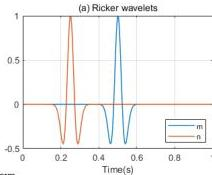
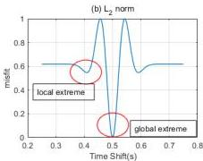
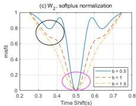

Remote Sens. 2024, 16, 4146

7 of 19

global minimum is obtained in Figure 2c without local minima. It indicates that the inversion process will not fall into local minima, avoiding cycle-skipping artifacts. Therefore, choosing a larger value of b provides better convex behavior relative to time shifts.

**Figure 2.** (a) Ricker wavelets $m$ and $n$. (b) The objective function with the $L_2$ norm. (c) The Softplus normalized objective function with the $W_2$ distance.

However, the choice of b should not be excessively large. As the value of b increases, the area around the global minimum of the objective function becomes smoother (indicated by the purple circle in Figure 2c). This implies that a larger b value will reduce the convergence speed toward the global minimum. Ultimately, the resolution of the final inversion result is decreased. Therefore, in this study, we chose the Softplus scaling function to preprocess the electromagnetic signals and determined the appropriate value of b through numerical experiments.

### 3. Numerical Examples

Three GPR multi-scale frequency-domain dual-parameter inversion cases are given in this section. First, a simple model is used to compare and analyze the dependence of the $W_2$ distance and $L_2$ norms on the initial model. The second study investigates the sensitivity of the $W_2$ distance and $L_2$ norm to noise. The third case validates that the FWI method using the $W_2$ distance achieves higher accuracy with a complex model. The Softplus normalization method is applied to the $W_2$ distance.

#### 3.1. Example 1: Comparison of Initial Model Dependence

This example demonstrates the difference in the objective functions between the $L_2$ norm and the $W_2$ distance for a toy model. The case involves a simple model with a homogeneous background medium and three simple geological anomalies. By changing the initial model, the dependence of the two methods on the initial model is tested.

The model is shown in Figure 3. It has dimensions of $14 \times 7$ m in both the horizontal and vertical directions. The uniform background parameters are $\varepsilon_r = 15$ and $\sigma = 0.1$ mS/m. The model contains one circular target and two rectangular targets. The circular target