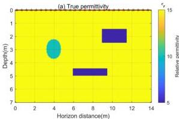
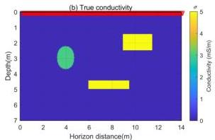

Remote Sens. 2024, 16, 4146

8 of 19

has a relative permittivity of $\varepsilon_r = 10$, a conductivity of $\sigma = 3$ mS/m, and a diameter of 1.5 m. The rectangular targets have a relative permittivity of $\varepsilon_r = 5$ and a conductivity of $\sigma = 5$ mS/m. The upper rectangular target has dimensions of $2.5 \times 1$ m, while the lower target has dimensions of $3.5 \times 0.5$ m. The grid spacing is $\Delta x = 0.05$ m and $\Delta z = 0.05$ m. The model is discretized into $N_{m1} = 280 \times 140 = 39,200$ cells. In this study, ground-penetrating radar multi-offset data were used for inversion. Multi-offset radar employs a one-to-many reception working mode, allowing for the investigation of multiple reflection angles, similar to multi-offset data collection in seismology. Compared to single-offset radar, multi-offset radar data offer greater imaging advantages, significantly improving lateral imaging capabilities, and have been successfully applied in geological investigations and other areas [4]. The transmitter positions placed on the surface were spaced 0.5 m apart, with a total of 29 transmitters. The receiver antennas were spaced 0.1 m apart, with a total of 141 receivers. In Figure 3, the transmitter positions are indicated by red asterisks in the relative permittivity model (a), while the receiver positions are shown as red triangles in the conductivity model (b). All receiver antennas recorded the high-frequency electromagnetic signals transmitted by each transmitter.

**Figure 3.** (a) The true relative permittivity model, where the red asterisks represent the transmitter antennas. (b) The true conductivity model, where red triangles represent the receiver antennas.

In addition to the true subsurface relative permittivity model and conductivity model, an initial model is also required for the full-waveform inversion of GPR data. To further verify the dependency of the FWI method using the Wasserstein distance on the initial model, two different initial models, I and II, were used, as shown in Figures 4 and 5. Both initial models used a homogeneous background medium. Initial model I had a relative permittivity and conductivity of 15 and 0.1 mS/m, respectively, which match the background parameters of the true model. Initial model II had values of 10 and 1 mS/m.

The wave equation solver is developed in [31] to simulate GPR forward data. A frequency-domain multi-scale FWI method is employed to simultaneously invert the relative permittivity and conductivity models [8]. The inversion begins with low-frequency data to establish an accurate background model and gradually incorporates higher-frequency data as the iterations progress. The frequencies used in the inversion are divided into multiple batches, as shown in Table 1. Multiple frequency data are input in each iteration [16] to address the computational burden of single-frequency inversion. The multi-scale frequency-domain data required for inversion are obtained through the Fast Fourier Transform (FFT). For model I, the Ricker waves with a center frequency of 100 MHz are used for forward simulation. During the inversion process, the simulated GPR data are discretized into 19 frequencies and divided into 15 batches. The frequency range is from $f_{min} = 1$ MHz to $f_{max} = 120$ MHz. Each batch contains four frequencies. And after 10 iterations for each batch, inversion is continued using the frequency-domain data from the next batch.