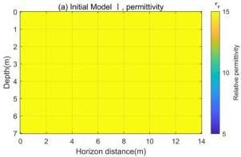
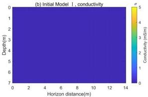
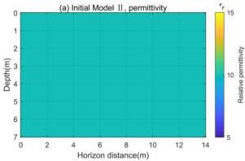
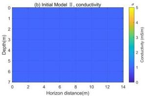

Remote Sens. 2024, 16, 4146

9 of 19

Figure 4. Initial model I. Initial relative permittivity model (a) and initial conductivity model (b) with true model background medium.

Figure 5. Initial model II. Initial relative permittivity model (a) and initial conductivity model (b) with true model background medium.

Table 1. Iterative batches for discrete frequencies.

|  batchn |  |  |  |  | Frequency (MHz)  |   |   |   |   |   |
| --- | --- | --- | --- | --- | --- | --- | --- | --- | --- | --- |
|  batch1 | 1 | 5 | 10 | 15 |  |  |  |  |  |   |
|  batch2 |  | 5 | 10 | 15 | 20 |  |  |  |  |   |
|  batch3 |  |  | 10 | 15 | 20 | 25 |  |  |  |   |
|  ... |  |  |  |  |  | ... |  |  |  |   |
|  batch15 |  |  |  |  |  |  | 90 | 100 | 110 | 120  |

The multi-scale frequency-domain inversion is performed using the Wasserstein distance as the objective function. Model I (Figure 4) and model II (Figure 5) are used as initial models to compare the inversion performance of  \( W_{2} - FWI \)  and  \( L_{2} - FWI \) . The inversion results are shown in Figures 6–9.

In Figure 7, the inversion results using the \( W_{2} \) distance with initial model I are presented, while Figure 6 shows the inversion results using the \( L_{2} \) norm as the FWI misfit function. Comparing Figure 6d,h with Figure 7d,h, both inversion methods produce good imaging results for relative permittivity and conductivity when the initial model is close to the true model. However, in the \( L_{2} \) norm inversion, artifacts affect the inversion results of both the relative permittivity and conductivity of the target (Figure 6e–h). The interference in the conductivity inversion is more pronounced, causing the target's edges to appear unclear and distorted. Similar effects can also be observed in Figure 6a–d. In contrast, these