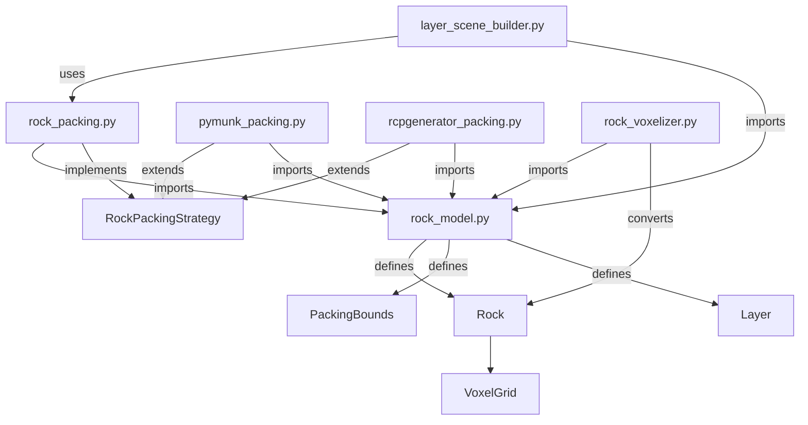

# Synth-GPR Module Relationships Documentation

## Overview
This document maps the dependencies and interactions between key modules in the Synth-GPR codebase, revealing the architectural patterns and data flow.

## Core Module Relationships

### 1. Rock Modeling & Packing System


**Key Relationships:**
- `rock_model.py` defines the domain entities (Rock, PackingBounds, Layer)
- `rock_packing.py` provides the abstract strategy interface
- Multiple concrete strategies (pymunk, rcpgenerator) implement different packing algorithms
- `rock_voxelizer.py` converts rock models to voxel representations for simulation
- `layer_scene_builder.py` orchestrates rock packing into complete scenes

### 2. Signal Processing Pipeline
```mermaid
graph TD
    signal_processing[signal_processing.py] -->|core| preprocessing
    signal_processing -->|core| bscan_processing
    signal_processing -->|core| coda_objectives
    signal_processing -->|core| reflector_picking
    signal_processing -->|core| spectral_attributes
    
    vivanco_pipeline[vivanco_pipeline.py] -->|imports| signal_processing
    vivanco_pipeline -->|uses| dzt_io
    vivanco_pipeline -->|uses| preprocessing
    
    feature_extraction[feature_extraction.py] -->|imports| signal_processing
    feature_extraction -->|uses| preprocessing
    
    dzt_io[dzt_io.py] -->|reads| DZT files
    dzt_io -->|provides| raw traces
```

**Key Relationships:**
- `signal_processing.py` is the central hub that was split into specialized modules
- `vivanco_pipeline.py` implements the complete Rojas-Vivanco processing chain
- `feature_extraction.py` builds on the processed signals
- `dzt_io.py` handles the raw data input format

### 3. GPR Simulation Workflow
```mermaid
graph TD
    gprmax_runner[gprmax_runner.py] -->|executes| gprMax
    gprmax_runner -->|uses| config
    
    file_writer[file_writer.py] -->|generates| .in files
    file_writer -->|uses| gpr_commands
    
    layer_scene_builder -->|uses| file_writer
    layer_scene_builder -->|uses| rock_packing
    layer_scene_builder -->|generates| complete scenes
    
    dataset_generator[dataset_generator.py] -->|uses| file_writer
    dataset_generator -->|uses| gprmax_runner
    dataset_generator -->|orchestrates| simulation workflow
```

**Key Relationships:**
- `gprmax_runner.py` handles execution of gprMax simulations
- `file_writer.py` generates the input files using `gpr_commands.py`
- `layer_scene_builder.py` creates complete scene descriptions
- `dataset_generator.py` orchestrates the full simulation pipeline

### 4. Visualization System
```mermaid
graph TD
    visualization_render[visualization/render.py] -->|imports| scene_3d
    visualization_render -->|uses| rock_model
    
    visualization_scene_3d[visualization/scene_3d.py] -->|renders| 3D scenes
    visualization_scene_3d -->|uses| rock_model
    
    unified_visualizer[scripts/visualization/unified_visualizer.py] -->|uses| visualization modules
    unified_visualizer -->|uses| signal_processing
    unified_visualizer -->|uses| feature_extraction
```

**Key Relationships:**
- 3D visualization builds on the rock model domain entities
- Visualization modules are separated from core processing
- `unified_visualizer.py` integrates multiple data sources

### 5. Data Access & Repository Pattern
```mermaid
graph TD
    data_access_readers[data_access/readers.py] -->|implements| data reading
    data_access_writers[data_access/writers.py] -->|implements| data writing
    
    repositories_scene[repositories/scene_repository.py] -->|uses| data_access
    repositories_scene -->|implements| repository pattern
    
    domain_models[domain/] -->|defines| value objects
    domain_models -->|defines| coordinates
    domain_models -->|defines| scene_parameters
```

**Key Relationships:**
- Clean separation between data access and business logic
- Repository pattern for scene management
- Domain models define core value objects

## Cross-Module Integration Points

### Major Integration Hubs
1. **`layer_scene_builder.py`** - Integrates rock packing with scene generation
2. **`signal_processing.py`** - Central processing hub (split into submodules)
3. **`vivanco_pipeline.py`** - Complete processing workflow
4. **`dataset_generator.py`** - Simulation orchestration

### Key Dependency Chains

**Rock Packing → Scene Generation → Simulation:**
```
rock_model → rock_packing → layer_scene_builder → file_writer → gprmax_runner
```

**Data Acquisition → Processing → Features:**
```
dzt_io → signal_processing → vivanco_pipeline → feature_extraction
```

**3D Modeling → Visualization:**
```
rock_model → rock_voxelizer → visualization/scene_3d → visualization/render
```

## Architectural Patterns Identified

### 1. Strategy Pattern
- **Location**: `rock_packing.py` and concrete strategy implementations
- **Purpose**: Allows swapping different rock packing algorithms
- **Participants**:
  - `RockPackingStrategy` (interface)
  - `PoissonDiskPacking`, `PymunkPacking`, `RcpgeneratorPacking` (concrete strategies)
  - `layer_scene_builder.py` (client)

### 2. Repository Pattern
- **Location**: `repositories/` directory
- **Purpose**: Separates data access from business logic
- **Participants**:
  - `scene_repository.py` (repository interface)
  - `filesystem_repository.py` (concrete implementation)
  - `data_access/` (low-level I/O)

### 3. Domain-Driven Design
- **Location**: `domain/` directory
- **Purpose**: Clear separation of domain logic
- **Key Entities**:
  - `coordinates.py` - Spatial coordinate system
  - `scene_parameters.py` - Scene configuration
  - `value_objects.py` - Immutable value objects

### 4. Pipeline Pattern
- **Location**: `vivanco_pipeline.py`, `signal_processing.py`
- **Purpose**: Multi-stage data processing
- **Stages**:
  - Raw data → preprocessing → feature extraction → classification
  - Each stage has clear inputs/outputs

## Data Flow Analysis

### Simulation Data Flow
1. **Scene Definition**: `layer_spec.py` defines layer structure
2. **Rock Generation**: `rock_packing.py` strategies generate rock distributions
3. **Scene Assembly**: `layer_scene_builder.py` creates complete scene
4. **File Generation**: `file_writer.py` produces gprMax input files
5. **Simulation**: `gprmax_runner.py` executes gprMax
6. **Result Processing**: `signal_processing.py` processes simulation outputs

### Real Data Processing Flow
1. **Data Ingestion**: `dzt_io.py` reads DZT files
2. **Preprocessing**: `signal_processing.py` applies processing chain
3. **Feature Extraction**: `feature_extraction.py` computes features
4. **Classification**: `vivanco_pipeline.py` applies ML model
5. **Visualization**: `visualization/` modules display results

## Circular Dependency Analysis

The codebase shows good separation with minimal circular dependencies. Key observations:

**Healthy Dependencies:**
- Domain models (`rock_model.py`, `domain/`) are only depended on, never depend on others
- Processing modules depend on domain models but not on each other
- Visualization depends on domain and processing but not vice versa

**Managed Circularities:**
- `signal_processing.py` was split into submodules to break circular dependencies
- Each submodule (`preprocessing.py`, `bscan_processing.py`, etc.) has focused responsibilities

## Recommendations for Maintainability

1. **Document the Strategy Pattern**: Clearly document how to add new rock packing strategies
2. **Enhance Module Boundaries**: Consider further splitting `signal_processing.py` if it grows
3. **Dependency Injection**: For testing, consider DI for `gprmax_runner.py`
4. **Interface Documentation**: Document the expected inputs/outputs of major pipelines
5. **Architecture Diagram**: Maintain this relationship documentation as the codebase evolves

## Key Integration Points for New Development

If extending the system:

1. **Adding new packing algorithms**: Implement `RockPackingStrategy` interface
2. **Adding new processing steps**: Extend `signal_processing.py` or create new submodule
3. **Adding new visualization**: Create new module in `visualization/` using existing patterns
4. **Adding new data formats**: Extend `data_access/` and create new repository if needed

This modular architecture supports research and experimentation while maintaining code organization.